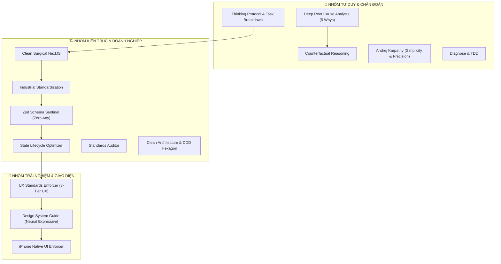

# 🛡️ CẨM NĂNG SỬ DỤNG HỆ THỐNG SKILLS & AGENTS — AUTO 28 SHOWROOM MANAGER

Chào mừng bạn đến với **Cẩm nang Vận hành Kỹ thuật & Chuẩn hóa Hệ thống** của **Auto 28 Showroom Manager**. Tài liệu này tổng hợp toàn bộ các Core Skills và Subagents chuyên trách tại thư mục `.agents/`, nhằm phục vụ tối đa việc phát triển, kiểm định kiến trúc Clean Architecture, và thực thi trải nghiệm người dùng cao cấp chuẩn Apple Native / Liquid Glass 2.0.

---

## 🤖 HỆ THỐNG SUBAGENTS CHUYÊN TRÁCH (.agents/agents/)

| Agent Identifier | Tên Chuyên Môn & Trách Nhiệm | Link Định Nghĩa |
| :--- | :--- | :--- |
| **`app_industrial_lead`** | **Kỹ Sư Trưởng Chuẩn Hóa Toàn Diện Web & Mobile App:** Chỉ huy tổng thể 6 trụ cột công nghiệp: Clean Arch, Core Web Vitals, UX 3 tầng, OWASP ASVS/RBAC, CI/CD Gate và Mobile Native. | [app_industrial_lead.md](file:///.agents/agents/app_industrial_lead.md) |
| **`industrial_standardizer`** | **Kỹ Sư Trưởng Chuẩn Hóa Doanh Nghiệp:** Phân tầng Clean Architecture, dọn dẹp mã nguồn, giải quyết triệt để Zod Schemas & Zero Any, tối ưu hóa vòng đời State React 19. | [industrial_standardizer.md](file:///.agents/agents/industrial_standardizer.md) |
| **`standards_inspector`** | **Thanh Tra Trưởng Độc Lập:** Kiểm tra nhị phân (PASS/FAIL) 6 tiêu chuẩn vàng Auto 28 (Type Safety, Clean Arch, Mã Xe SSoT, RBAC Kế toán/Admin, SSoT Finance, iPhone Native UI). | [standards_inspector.md](file:///.agents/agents/standards_inspector.md) |
| **`ux_standardizer`** | **Kỹ Sư Trưởng Trải Nghiệm Người Dùng:** Thẩm định & thực thi UX/UI 3 tầng (Standard $\rightarrow$ Advanced $\rightarrow$ Enterprise), kiểm soát độ trễ 0ms, Spring Physics, Haptic Matrix và Liquid Glass 2.0. | [ux_standardizer.md](file:///.agents/agents/ux_standardizer.md) |

---

## 🗺️ BẢN ĐỒ PHÂN NHÓM SKILLS CỐT LÕI



---

## 🛠️ CHI TIẾT CÁC CORE SKILLS CHUYÊN DỤNG

### 1. 🧠 Thinking Protocol & Task Decomposition Engine
* **Mục tiêu:** Phân tích rủi ro, phân loại độ phức tạp và lập kế hoạch nguyên tử trước khi viết code.
* **Kích hoạt:** *"Phân tích rủi ro và lên kế hoạch chi tiết cho tính năng này"*.

### 2. 🛡️ Clean Surgical NextJS (Master Standard)
* **Mục tiêu:** Hiến pháp kỹ thuật tối cao: Zero Any, Dumb UI, Zod Boundary, State Machine Gateway.
* **Kích hoạt:** *"Viết tính năng chuẩn Clean Surgical NextJS"*.

### 3. ⚖️ Counterfactual Reasoning (Lập luận phản thực)
* **Mục tiêu:** Ép buộc so sánh ít nhất 2–3 phương án kiến trúc và loại trừ có lý do trước khi chốt giải pháp.
* **Kích hoạt:** *"So sánh phản thực các phương án kiến trúc giúp tôi"*.

### 4. 🔍 Deep Root Cause Analysis (5 Whys)
* **Mục tiêu:** Chẩn đoán lỗi tận gốc rễ bằng phương pháp 5 Whys, lập Fix Plan và chờ phê duyệt.
* **Kích hoạt:** *"Chẩn đoán Root Cause và lập Fix Plan cho lỗi này"*.

### 5. 🎨 UX Standards Enforcer (Tiêu Chuẩn Trải Nghiệm 3 Tầng)
* **Mục tiêu:** Thực thi và thẩm định UX từ Tiêu chuẩn (ISO 9241, WCAG 2.2, Core Web Vitals) đến Nâng cao (Neuro-UX, Fitts/Hick Laws, Zero-Latency, Optimistic UI) và Cao cấp Doanh nghiệp (Liquid Glass, Spring Physics, Haptic Matrix, SSoT Finance).
* **Kích hoạt:** *"Audit UX/UI theo chuẩn công nghiệp"*, *"Tối ưu hóa trải nghiệm người dùng"*.

### 6. 🎨 Design System Code Guide (Neural Expressive 2.0)
* **Mục tiêu:** Sử dụng các thành phần giao diện chuẩn từ `src/shared/design-system/` (`BaseCard`, `BaseInput`, `DataDisplay`, `SmartAmountInput`, `BaseModal`).
* **Kích hoạt:** *"Thiết kế UI chuẩn Neural Expressive 2.0"*.

### 7. 🍎 iPhone Native UI Enforcer (Apple Standard V2.0)
* **Mục tiêu:** Đảm bảo Safe Area `env(safe-area-inset-top/bottom)`, Touch target $\ge 44\text{px}$, co giãn `active:scale-95`, chống khuyết chữ.
* **Kích hoạt:** *"Tối ưu giao diện iPhone Native UI"*.

### 8. 🚀 Andrej Karpathy (Karpathy Precision)
* **Mục tiêu:** Giữ code tối giản, phẫu thuật chính xác đúng dòng cần sửa, chống over-engineering.
* **Kích hoạt:** *"Viết code Karpathy Mode, phẫu thuật chính xác"*.

### 9. 🏭 Industrial Standardization (Chuẩn Hóa Doanh Nghiệp)
* **Mục tiêu:** 5 giai đoạn chuẩn hóa: Dọn dẹp dependencies rác, Zero Any Zod schemas, phân tầng IoC, tối ưu State, tự động hóa kiểm thử.
* **Kích hoạt:** *"Chuẩn hóa dự án đạt chuẩn công nghiệp"*.

### 10. 🛡️ Zod Schema Sentinel (Bảo Vệ Toàn Vẹn Dữ Liệu)
* **Mục tiêu:** Chống Zod strip dữ liệu (`license_plate`, `phone`, `auth_id`), loại bỏ `as any`, đồng bộ DB $\leftrightarrow$ Domain Type $\leftrightarrow$ Zod.
* **Kích hoạt:** *"Đồng bộ Zod Schema và loại bỏ as any"*.

### 11. ⚡ State Lifecycle Optimizer (Tối Ưu Vòng Đời & Hiệu Năng)
* **Mục tiêu:** Nâng state lên Dispatcher Page, loại bỏ cascading renders trong `useEffect`, debounce real-time sync.
* **Kích hoạt:** *"Tối ưu hóa state lifecycle và chống giật lag"*.

### 12. 🛡️ Standards Auditor (Thanh Tra Tiêu Chuẩn)
* **Mục tiêu:** Chạy lệnh `npm run audit:standards` kiểm tra 6 tiêu chuẩn vàng Auto 28 đạt 100/100 điểm.
* **Kích hoạt:** *"Kiểm tra tiêu chuẩn dự án"*, *"Chạy audit standards"*.

---

## ⚡ BỘ LỆNH KIỂM ĐỊNH TOÀN DIỆN (CI/CD VERIFICATION)

```bash
# 1. Kiểm tra Linter
npx eslint src

# 2. Kiểm tra biên dịch TypeScript (Zero Errors)
npx tsc --noEmit

# 3. Kiểm tra ranh giới phân tầng kiến trúc
npm run lint:arch

# 4. Chạy Unit Tests
npm test

# 5. Chạy bộ thẩm định tiêu chuẩn độc lập Auto 28
npm run audit:standards
```
