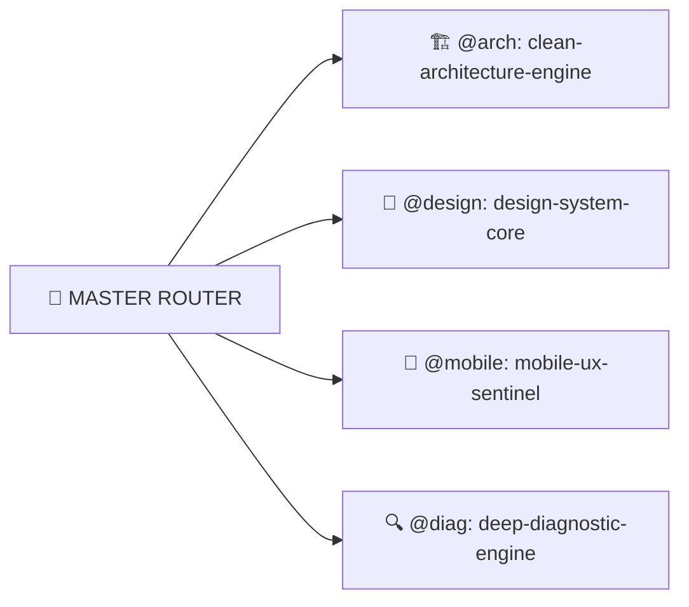

# 🤖 AGENT & SKILL CATALOG — AUTO 28 SHOWROOM MANAGER

Hệ sinh thái Agent & Skills của Auto 28 được tổ chức theo **Mô hình Hợp nhất Phân tầng (Hierarchical Domain Consolidation & Router Pattern)**, tuân thủ chuẩn IEEE P3172 Multi-Agent Protocol.

---

## 🧭 BỘ ĐIỀU PHỐI TRUNG TÂM (MASTER ORCHESTRATOR)

* **File Điều Phối:** [ROUTER.md](file:///.agents/ROUTER.md) & [app_industrial_lead.md](file:///.agents/agents/app_industrial_lead.md)
* **Quy Tắc Bất Biến:** [core_rules.md](file:///.agents/rules/core_rules.md)

---

## 🏛️ 4 DOMAIN HUBS CHUYÊN MÔN

### 1. 🏗️ DOMAIN 1: @arch (`clean-architecture-engine`)
* **Định nghĩa:** [.agents/skills/clean-architecture-engine/SKILL.md](file:///.agents/skills/clean-architecture-engine/SKILL.md)
* **Chuyên trách:** Phân tầng Clean Architecture (Domain/Application/Presentation/Infra), Inversion of Control (IoC), TypeScript Strict Zero-Any, Zod Schema Parity (Anti-Data-Truncation), React 19 State Lifecycle, SSoT Finance và Kiểm định chất lượng nhị phân.

### 2. 🎨 DOMAIN 2: @design / @swiss (`design-system-core` & `swiss-precision-executive`)
* **Định nghĩa:** [.agents/skills/design-system-core/SKILL.md](file:///.agents/skills/design-system-core/SKILL.md) & [.agents/skills/swiss-precision-executive/SKILL.md](file:///.agents/skills/swiss-precision-executive/SKILL.md)
* **Agent Chuyên Trách:** [.agents/agents/swiss_precision_executive.md](file:///.agents/agents/swiss_precision_executive.md) & [.agents/agents/color_system_sentinel.md](file:///.agents/agents/color_system_sentinel.md)
* **Chuyên trách:** Single Source of Truth cho Design System (`src/shared/design-system/`), Ngôn ngữ thiết kế **Swiss Precision Executive**, Design Tokens OKLCH (Tỷ lệ 60-30-10), Giới hạn mật độ màu Card ($\le 2$ Accents/2 Pills), Squircle Geometry (`rounded-[20px]` – `rounded-[32px]`), 3-Tier Input Sizing, Safe Glassmorphism $\ge 75\%$, Ngữ nghĩa biểu tượng Bio-Iconography và Chống gãy dòng (Anti-Truncation).

### 3. 📱 DOMAIN 3: @mobile (`mobile-ux-sentinel`)
* **Định nghĩa:** [.agents/skills/mobile-ux-sentinel/SKILL.md](file:///.agents/skills/mobile-ux-sentinel/SKILL.md)
* **Chuyên trách:** Chuẩn iPhone Native: Safe Area (`env(safe-area-inset-*)`), Dynamic Bottom Navigation (3–5 tabs, Hero FAB `+`), Capacitor Haptic Matrix, Chuẩn hóa Ngôn ngữ viết & Từ điển Showroom SSoT, WCAG 2.2 AA.

### 4. 🔍 DOMAIN 4: @diag (`deep-diagnostic-engine`)
* **Định nghĩa:** [.agents/skills/deep-diagnostic-engine/SKILL.md](file:///.agents/skills/deep-diagnostic-engine/SKILL.md)
* **Chuyên trách:** Giao thức Tư duy Sâu (Thinking Protocol), Chẩn đoán Nguyên nhân Gốc rễ 5 Whys, Lập luận Phản thực (Counterfactual A/B evaluation), Karpathy Surgical Editing và Vòng lặp Kiểm thử TDD.
