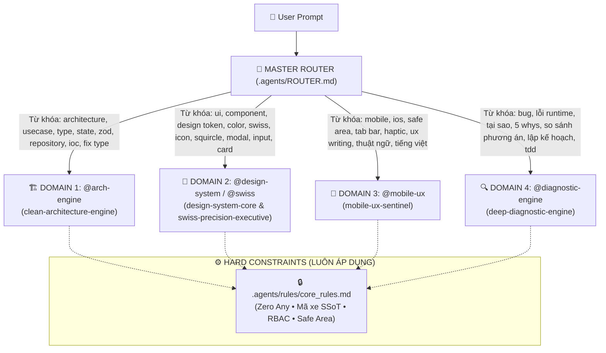

# 🧭 MASTER INTENT ROUTER & DISPATCHER — AUTO 28 SHOWROOM MANAGER

> **Bản quyền & Tiêu chuẩn:** IEEE P3172 Multi-Agent Architecture Standard  
> **Cổng vào:** Duy nhất (`Single Point of Dispatch`)  
> **Mục tiêu:** Tự động phân loại User Prompt và nạp chính xác 1 trong 4 Domain Hubs, loại bỏ 100% tình trạng nạp chồng chất và xung đột chỉ thị.

---

## 🗺️ BẢN ĐỒ ĐỊNH TUYẾN 4 DOMAIN HUBS

---

## 🎯 BẢNG TRA CỨU ĐỊNH TUYẾN (DISPATCH MATRIX)

| Mã Kích Hoạt | Domain Hub | File Skill Đại Diện | Trọng Tâm Nhiệm Vụ |
| :--- | :--- | :--- | :--- |
| **`@arch`** | **Architecture & Code Quality** | [clean-architecture-engine](file:///.agents/skills/clean-architecture-engine/SKILL.md) | Phân tầng Clean Architecture (Domain/App/Presentation/Infra), Inversion of Control, Zod Schemas & Zero Any, React 19 State Lifecycle, SSoT Repository & Use Cases, Standards Audit. |
| **`@design`** / **`@swiss`** | **Design System SSoT & Swiss Precision** | [design-system-core](file:///.agents/skills/design-system-core/SKILL.md) & [swiss-precision-executive](file:///.agents/skills/swiss-precision-executive/SKILL.md) | Quản trị thư viện dùng chung (`src/shared/design-system/`), Chuẩn màu Swiss Precision OKLCH (60-30-10), Mật độ màu Card (≤2 Accents/2 Pills), Squircle Geometry, 3-Tier Input Sizing, Safe Glassmorphism. |
| **`@mobile`** | **Mobile & Native UX Sentinel** | [mobile-ux-sentinel](file:///.agents/skills/mobile-ux-sentinel/SKILL.md) | iPhone Native (Safe Area ≥34px, Dynamic Island), Dynamic Bottom Navigation & FAB, Capacitor Haptic Matrix, Chuẩn hóa Ngôn ngữ viết & Từ điển Showroom, WCAG 2.2 AA. |
| **`@diag`** | **Diagnostic & Reasoning Protocol** | [deep-diagnostic-engine](file:///.agents/skills/deep-diagnostic-engine/SKILL.md) | Quy trình 5 Whys Root Cause, So sánh phản thực Counterfactual Reasoning (A/B), Phân rã task nguyên tử Thinking Protocol, Karpathy Surgical Edits, TDD Loop. |

---

## 🔄 QUY TRÌNH PHỐI HỢP ĐA DOMAIN (ORCHESTRATION PIPELINES)

Khi người dùng đưa ra yêu cầu phức tạp trải dài qua nhiều lĩnh vực, Router sẽ điều phối theo chuỗi tuần tự có thứ tự ưu tiên:

### 1. Luồng Phát triển Tính năng Mới (Feature Pipeline):
$$\text{User Prompt} \longrightarrow \underbrace{\text{@diag}}_{\text{Lập kế hoạch \& A/B}} \longrightarrow \underbrace{\text{@arch}}_{\text{Domain \& UseCase}} \longrightarrow \underbrace{\text{@design}}_{\text{UI Component}} \longrightarrow \underbrace{\text{@mobile}}_{\text{Native UX \& Haptic}}$$

### 2. Luồng Sửa Lỗi Nghiêm Trọng (Bugfix Pipeline):
$$\text{User Error Report} \longrightarrow \underbrace{\text{@diag}}_{\text{5 Whys Root Cause}} \longrightarrow \underbrace{\text{@arch}}_{\text{Surgical Fix \& Type Safety}} \longrightarrow \underbrace{\text{@arch}}_{\text{Audit Verification}}$$

### 3. Luồng Kiểm Định Tổng Thể (Comprehensive Audit Pipeline):
$$\text{Audit Request} \longrightarrow \underbrace{\text{@arch}}_{\text{Lint \& Zero-Any Gate}} \longrightarrow \underbrace{\text{@design}}_{\text{Geometry \& Tokens}} \longrightarrow \underbrace{\text{@mobile}}_{\text{Safe Area \& WCAG}}$$
