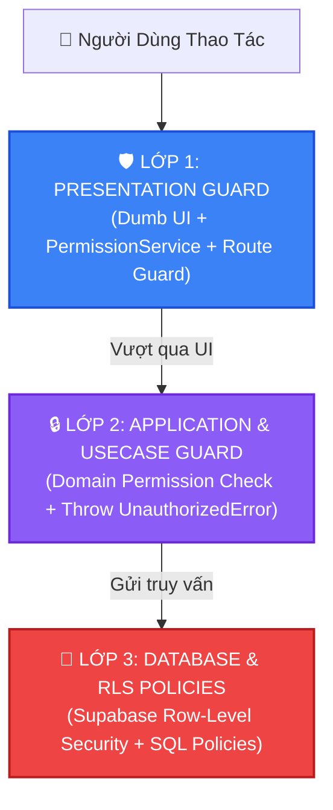

# 🔐 SKILL: RBAC & ACCESS GOVERNANCE SENTINEL

> **Mã kích hoạt:** `@rbac` hoặc `rbac-access-governance`  
> **Tiêu chuẩn áp dụng:** ISO/IEC 27001:2022 • OWASP ASVS Level 2 • Zero Trust Architecture (NIST SP 800-207) • Swiss Precision UI  
> **Thành phần trọng tâm:** `src/modules/auth/`, `src/shared/presentation/components/Layout/MainContent.tsx`, `Header.tsx`, `MobileBottomNav.tsx`

---

## 🏛️ 1. MA TRẬN PHÂN QUYỀN CHUẨN DOANH NGHIỆP (SSoT PERMISSIONS MATRIX)

Hệ thống Auto 28 phân định 4 nhóm vai trò chính (`UserRole`) với ranh giới trách nhiệm và quyền hạn tuyệt đối:

```
┌─────────────────────────────────────────────────────────────────────────────┐
│                    MA TRẬN QUYỀN HẠN AUTO 28 SHOWROOM                       │
├──────────────────────────┬───────────┬──────────────┬──────────┬────────────┤
│ Quyền Hạn (Permission)   │   ADMIN   │  ACCOUNTANT  │  LEADER  │   STAFF    │
├──────────────────────────┼───────────┼──────────────┼──────────┼────────────┤
│ VIEW_INVENTORY           │     ✅    │      ✅      │    ✅    │     ✅     │
│ EDIT_INVENTORY           │     ✅    │      ✅      │    ❌    │     ❌     │
│ CHANGE_VEHICLE_STATUS    │     ✅    │      ✅      │    ❌    │     ❌     │
│ VIEW_PURCHASE_PRICE      │     ✅    │      ✅      │    ❌    │     ❌     │
│ VIEW_PROFIT_MARGIN       │     ✅    │      ✅      │    ❌    │     ❌     │
│ VIEW_FINANCE_TAB         │     ✅    │      ✅      │    ❌    │     ❌     │
│ MANAGE_CASHFLOW          │     ✅    │      ✅      │    ❌    │     ❌     │
│ VIEW_COMMISSION          │     ✅    │      ✅      │    ✅    │  Chỉ cá nhân│
│ MANAGE_STAFF             │     ✅    │      ❌      │    ❌    │     ❌     │
│ VIEW_PERMISSIONS_TAB     │     ✅    │      ❌      │    ❌    │     ❌     │
│ EDIT_ROLE_PERMISSIONS    │     ✅    │      ❌      │    ❌    │     ❌     │
└──────────────────────────┴───────────┴──────────────┴──────────┴────────────┘
```

---

## 🛡️ 2. KIẾN TRÚC PHÒNG THỦ 3 LỚP (3-TIER DEFENSE-IN-DEPTH GATE)

Mọi thao tác nhạy cảm trong hệ thống bắt buộc phải được bảo vệ qua 3 lớp phòng thủ độc lập:



### 🔹 Lớp 1: Presentation & Route Guard (`MainContent.tsx` & `PermissionService`)
* **Chặn Render Component:** Không mount hoặc render các Tab nhạy cảm nếu người dùng không đủ quyền:
  ```typescript
  // src/shared/presentation/components/Layout/MainContent.tsx
  if (activeTab === 'permissions') {
    if (userRole !== 'ADMIN') {
      return <AccessDeniedView reason="Chỉ Quản trị viên cấp cao mới có quyền truy cập trang này." />;
    }
    return (
      <Suspense fallback={<PermissionsSkeleton />}>
        <PermissionsPage ... />
      </Suspense>
    );
  }
  ```
* **Chặn Render Nút Bấm:** Sử dụng `hasPermission()` hoặc boolean guard `isAdminOrAccountant`:
  ```typescript
  {isAdminOrAccountant && (
    <Button onClick={handleOpenStatusModal} variant="primary">
      Chuyển trạng thái xe
    </Button>
  )}
  ```

### 🔹 Lớp 2: Application & UseCase Guard
* Mỗi UseCase thực hiện nghiệp vụ nhạy cảm phải kiểm tra quyền của `currentUser` trước khi gọi Repository:
  ```typescript
  export class UpdateVehicleStatusUseCase {
    constructor(private permissionService: PermissionService, private vehicleRepo: VehicleRepository) {}

    async execute(user: Staff, vehicleId: string, newStatus: VehicleStatus): Promise<void> {
      if (!this.permissionService.hasPermission(user.role, PERMISSIONS.CHANGE_VEHICLE_STATUS)) {
        throw new UnauthorizedError('Bạn không có quyền thay đổi trạng thái xe.');
      }
      return this.vehicleRepo.updateStatus(vehicleId, newStatus);
    }
  }
  ```

### 🔹 Lớp 3: Database Row-Level Security (RLS)
* Bật RLS trên toàn bộ bảng dữ liệu nhạy cảm (`vehicles`, `staff`, `cashflow_transactions`, `permissions`):
  ```sql
  -- Chỉ ADMIN mới có quyền sửa đổi bảng permissions
  CREATE POLICY "Admin full access permissions"
  ON public.permissions
  FOR ALL
  TO authenticated
  USING (auth.jwt() ->> 'role' = 'ADMIN')
  WITH CHECK (auth.jwt() ->> 'role' = 'ADMIN');
  ```

---

## 🎨 3. TIÊU CHUẨN SKELETON LOADING & ANTI-LAYOUT SHIFT (CLS = 0)

Khi lazy load các trang trong `MainContent.tsx`, bắt buộc tuân thủ chuẩn thiết kế **Swiss Precision Skeleton**:

1. **Squircle Geometry:** Toàn bộ khung container skeleton sử dụng bo góc `rounded-[2.5rem]` hoặc `rounded-2xl` đồng bộ với component thật.
2. **Shimmer Pulse Dynamics:** Áp dụng hiệu ứng nhịp thở `animate-pulse` với màu `bg-black/5` (hoặc `bg-kraft-accent/10` cho các khối điểm nhấn).
3. **Staggered Animation Delay:** Phân tầng thời gian trễ animation giữa các dòng (`style={{ animationDelay: `${i * 40}ms` }}`) tạo cảm giác chuyển động mượt mà.
4. **Tỷ Lệ Kích Thước 1:1:** Khung skeleton phải có chiều cao, số cột và khoảng cách padding/gap khớp hoàn toàn với giao diện khi nạp xong, triệt tiêu hiện tượng giật giật (Cumulative Layout Shift - CLS).

---

## 🧪 4. DANH MỤC KIỂM ĐỊNH BẢO MẬT (RBAC AUDIT CHECKLIST)

Trước khi nghiệm thu mọi thay đổi liên quan đến quyền truy cập:

- [ ] **Chống leo thang đặc quyền:** Đăng nhập tài khoản `STAFF`, thử đổi URL hash sang `#permissions` hoặc `#cashflow` $\rightarrow$ Hệ thống phải chặn và fallback về trang mặc định hoặc báo `AccessDeniedView`.
- [ ] **Bảo vệ tài chính xe:** Tài khoản `STAFF` xem chi tiết xe không được thấy giá vốn nhập (`purchase_price`), lợi nhuận (`expected_profit`), và nút đổi trạng thái xe.
- [ ] **Bảo vệ danh sách nhân sự:** Tài khoản `STAFF` chỉ xem được thông tin cá nhân của mình tại tab `personal`, không được xem bảng lương toàn showroom.
- [ ] **Toàn vẹn Type Safety:** Không sử dụng `as any` khi ép kiểu `userRole` hoặc `permissions`.
- [ ] **Không lỗi compile:** Chạy `npx tsc --noEmit` đạt 0 lỗi.
