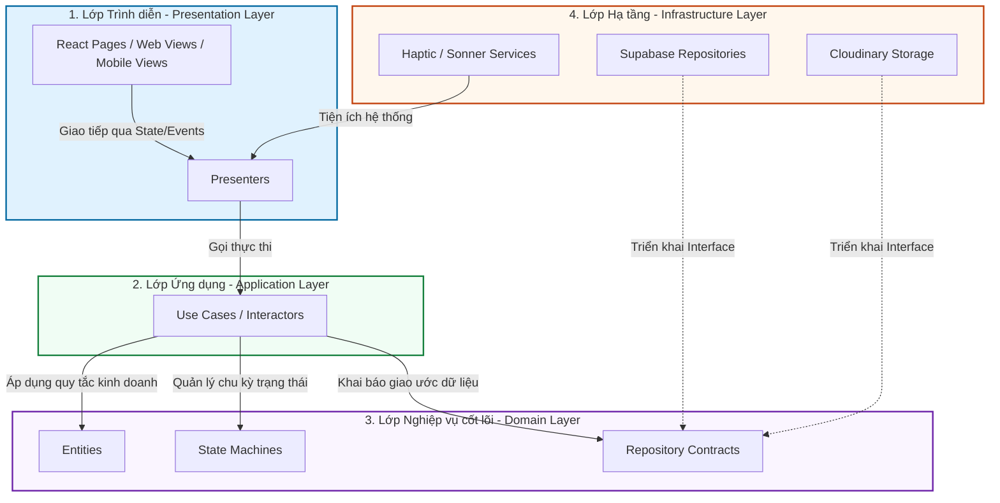

# 🗺️ BẢN ĐỒ MODULE HỆ THỐNG: AUTO 28 SHOWROOM MANAGER
> **Phiên bản:** 2.0-Production (Neural Expressive & Explicit Clean MVP Architecture)  
> **Tài liệu tham chiếu kiến trúc chính thống (SSOT) của Auto 28 Showroom**

Tài liệu này cung cấp cái nhìn toàn cảnh, sâu sắc và có hệ thống về cấu trúc mô-đun hóa, luồng dữ liệu, mối quan hệ phụ thuộc ngược (Dependency Inversion), và thiết kế phân lớp nghiệp vụ của dự án **Auto 28 Showroom Manager**.

---

## 🏛️ 1. TRIẾT LÝ KIẾN TRÚC TOÀN CỤC (ARCHITECTURAL PATTERNS)

Hệ thống được thiết kế theo mô hình **Modular Monolith** kết hợp chặt chẽ giữa **Clean Architecture** và mô hình **MVP (Model-View-Presenter)**. Hệ thống chia tách rõ rệt thành hai phân vùng chính: `modules/` (Chứa các nghiệp vụ cô lập) và `shared/` (Chứa tài nguyên dùng chung).



### 🌟 4 Quy tắc Vàng trong Kiến trúc:
> [!IMPORTANT]
> 1. **Quy tắc Phụ thuộc Một chiều (Dependency Rule):** Sự phụ thuộc luôn hướng vào trong (Presentation $\rightarrow$ Application $\rightarrow$ Domain). Lớp Domain cốt lõi hoàn toàn độc lập với các thư viện bên ngoài (Supabase, Cloudinary, Framer Motion).
> 2. **Kiến trúc MVP rõ rệt (Model-View-Presenter):** React Component chỉ đóng vai trò là "View ngốc nghếch" (Passive View), không chứa logic nghiệp vụ, không trực tiếp fetch database. Mọi logic định tuyến dữ liệu, kiểm soát trạng thái đều được ủy quyền cho **Presenter** quản lý.
> 3. **Đảo ngược sự phụ thuộc (Dependency Inversion):** Lớp Application hoặc Domain định nghĩa các giao ước (Interface/Repository Contracts). Lớp Infrastructure triển khai chúng. Khởi tạo và kết nối thông qua **IoC Container** (`DependencyContext`).
> 4. **Trực quan sinh học (Neural Expressive & Dual-Layout):** Toàn bộ giao diện hỗ trợ Responsive hoàn hảo với thiết kế layout song hành (ngăn ngang mượt mà cho Mobile View bám đáy và layout 3D dạng Liquid Glass bóng bẩy cho Desktop).

---

## ⚡ 2. BẢN ĐỒ IOC & CONTAINER PHỤ THUỘC (DEPENDENCY FLOW)

Mọi đối tượng (Repositories, Use Cases, Presenters) đều được khởi tạo tập trung và tiêm phụ thuộc (Dependency Injection) thông qua `DependencyContext.tsx` để tối ưu tài nguyên và dễ dàng kiểm thử (Mocking).

```mermaid
flowchart LR
    subgraph RepoFactory [Khởi Tạo Repositories]
        R1[SupabaseVehicleRepository]
        R2[SupabaseStaffRepository]
        R3[SupabaseExpenseRepository]
        R4[CloudinaryVehicleStorageRepository]
    end

    subgraph UseCaseFactory [Hợp Nhất Use Cases]
        U1[GetInventoryList]
        U2[UpdateVehicleStatus]
        U3[RecordExpense]
        U4[ProcessSalaryPayment]
    end

    subgraph PresenterFactory [Factory Khởi Tạo Presenters]
        P1[InventoryPresenter]
        P2[StaffPresenter]
        P3[FinancePresenter]
    end

    RepoFactory --> UseCaseFactory
    UseCaseFactory --> PresenterFactory
    PresenterFactory -->|Inject| UI[React UI View Components via useDependencies]
```



---

## 📂 3. PHÂN RÃ CHI TIẾT 9 MÔ-ĐUN NGHIỆP VỤ (`src/modules/`)

Mỗi mô-đun nghiệp vụ hoạt động như một thành phần độc lập trong hệ thống với cấu trúc thư mục khép kín:

```
src/modules/[module_name]/
├── domain/          # Entities, State Machines, Repository Interfaces
├── application/     # Use Cases (Xử lý các luồng nghiệp vụ cụ thể)
├── infrastructure/  # Repositories cụ thể kết nối Supabase/Cloudinary
└── presentation/    # Presenters, Pages, Components, Hooks
```

### 📊 Bảng so sánh đặc tính & phân bố của 9 mô-đun:

| Mô-đun nghiệp vụ | Cấu trúc phân lớp | Vai trò nghiệp vụ chính | Tương tác chéo (Cross-Module Dependency) |
| :--- | :--- | :--- | :--- |
| **1. `inventory`** | Đầy đủ 4 lớp | Quản lý kho xe, vòng đời xe, trạng thái lưu kho, lịch sử và giá vốn xe. | Phụ thuộc vào `staff` (tìm nhân viên mua/bán), `finance` (ghi nhận chi phí phát sinh). |
| **2. `finance`** | Đầy đủ 4 lớp | Dòng tiền, doanh thu chi phí, quản lý danh sách công nợ phải thu/nợ phải trả. | Phụ thuộc vào `inventory` (để tính toán dòng vốn xe), `staff` (tính hoa hồng & lương). |
| **3. `staff`** | Đầy đủ 4 lớp | Quản lý thông tin nhân sự, chế độ hoa hồng mua/bán xe, tạm ứng lương, chi phí hoàn ứng. | Kết nối với `payroll` (khi quyết toán bảng lương), `inventory` (xe nhân viên bán). |
| **4. `payroll`** | `domain`, `application` | Quyết toán lương cuối tháng, tính toán tự động hoa hồng thực nhận của nhân sự. | Phụ thuộc vào dữ liệu từ `staff` và `finance`. |
| **5. `personal`** | Chỉ `presentation` | Cổng thông tin cá nhân dành riêng cho sales/nhân viên xem hoa hồng, nợ nần cá nhân. | Tái sử dụng Presenter và Use Cases từ `staff` và `inventory`. |
| **6. `auth`** | Đầy đủ 4 lớp | Định danh, đăng nhập hệ thống, phân quyền chặt chẽ (RBAC) cho từng tính năng. | Cung cấp dịch vụ phân quyền toàn cục (`PermissionService`). |
| **7. `user`** | Đầy đủ 4 lớp | Quản lý tài khoản đăng nhập hệ thống, thông tin hồ sơ và mật khẩu. | Phụ thuộc mật thiết vào `auth`. |
| **8. `sandbox`** | Chỉ `presentation` | Phòng thí nghiệm thiết kế (Physics Lab), xác thực Token thị giác Liquid Glass và haptic. | Không có nghiệp vụ database, thuần túy là bộ trưng bày UI (Component Gallery). |
| **9. `dashboard`** | Chỉ `presentation` | Báo cáo trực quan dạng biểu đồ (Dashboard), tóm tắt nhanh sức khỏe tài chính tổng showroom. | Sử dụng dữ liệu tổng hợp từ `finance` Presenter. |

---

## 🛠️ 4. KIẾN TRÚC MÔ-ĐUN CHI TIẾT

### 🚗 4.1. Module Quản Lý Kho Xe (`inventory`)
Mô-đun phức tạp nhất hệ thống, kiểm soát tài sản showroom trị giá hàng tỷ đồng.
* **Domain Layer (`domain/`):**
  * `VehicleEntity.ts`: Thực thể định nghĩa thuộc tính xe (Tên, Năm sản xuất, ODO, Giá nhập, Giá chào bán, Trạng thái).
  * `VehicleStateMachine.ts`: Máy trạng thái nghiêm ngặt quản lý vòng đời xe (`IN_STOCK` $\rightarrow$ `DEPOSIT` $\rightarrow$ `SOLD` $\rightarrow$ `ORDER_CANCELLED`).
  * `VehicleRepository.ts`: Khai báo Interface giao tiếp cơ sở dữ liệu.
* **Application Layer (`application/`):**
  * `GetInventoryList.ts`: Lấy danh sách xe kèm bộ lọc nâng cao.
  * `AddVehicle.ts` / `UpdateVehicle.ts` / `DeleteVehicle.ts`: Xử lý thêm, sửa, xóa xe tích hợp kiểm tra mã tự sinh.
  * `AddPurchasePayment.ts` / `AddSalePayment.ts` / `CancelSale.ts`: Luồng giao dịch tài chính liên quan đến xe.
* **Infrastructure Layer (`infrastructure/`):**
  * `SupabaseVehicleRepository.ts`: Triển khai các phương thức truy vấn xe trực tiếp lên Supabase.
  * `CloudinaryVehicleStorageRepository.ts`: Tải ảnh xe lên Cloudinary, tối ưu hóa kích thước hiển thị.
* **Presentation Layer (`presentation/`):**
  * `InventoryPage.tsx` / `InventoryMobileView.tsx` / `InventoryWebView.tsx`: View đa nền tảng tối ưu.
  * `InventoryPresenter.ts`: Hợp nhất logic từ 3 Presenters con (`InventoryListPresenter`, `VehicleActionPresenter`, `VehicleTransactionPresenter`).

---

### 💰 4.2. Module Tài Chính & Dòng Tiền (`finance`)
Bộ não vận hành dòng tiền của showroom, quản lý nợ nần và tối ưu hóa lợi nhuận.
* **Domain Layer (`domain/`):**
  * `ExpenseRepository.ts`: Khai báo Interface quản lý chi phí phát sinh.
  * `FinanceService.ts`: Chứa logic nghiệp vụ tính toán dòng tiền, doanh thu ròng, chi phí vận hành.
* **Application Layer (`application/`):**
  * `GetMonthlyFinance.ts`: Tổng hợp doanh số, lãi gộp theo tháng.
  * `GetFinancialOverview.ts`: Tính toán dòng tiền khả dụng thực tế.
  * `RecordExpense.ts`: Ghi nhận chi phí phát sinh (nhập xe, hoàn ứng, trả lương).
* **Infrastructure Layer (`infrastructure/`):**
  * `SupabaseExpenseRepository.ts`: Thao tác bảng chi phí trên database.
* **Presentation Layer (`presentation/`):**
  * `FinancePresenter.ts`: Quản lý trạng thái dòng tiền và đồng bộ thông báo thời gian thực.
  * `CashflowPage.tsx` / `DashboardPage.tsx`: Màn hình tổng hợp dòng tiền và biểu đồ hiệu năng tài chính.

---

### 👥 4.3. Module Nhân Sự & Tiền Lương (`staff` & `payroll`)
Quản lý hiệu suất của đội ngũ showroom, tự động hóa hoa hồng kinh doanh.
* **Domain Layer (`domain/`):**
  * `StaffEntity.ts`: Định nghĩa nhân sự, lương cơ bản, định mức hoa hồng bán xe.
  * `StaffSalaryService.ts`: Tính toán lương chi tiết (Lương cơ bản + Lương hoa hồng xe mua/bán - Các khoản tạm ứng).
* **Application Layer (`application/`):**
  * `GetStaffList.ts`: Danh sách nhân viên kèm trạng thái xe đang đảm nhận.
  * `ReimburseStaffExpenses.ts`: Duyệt hoàn ứng các chi phí tạm tính nhân viên tự chi ra cho xe showroom.
  * `ProcessSalaryPayment.ts`: Thực thi quyết toán thanh toán bảng lương.
* **Presentation Layer (`presentation/`):**
  * `StaffPresenter.ts`: Điều khiển mọi hoạt động nhân sự.
  * `StaffPage.tsx` / `AccountPage.tsx`: Màn hình hồ sơ và quyết toán lương cao cấp.

---

### 🔐 4.4. Module Phân Quyền & Hệ Thống (`auth` & `user`)
Lớp bảo vệ vòng ngoài đảm bảo an toàn dữ liệu và phân quyền hoạt động.
* **Domain Layer (`domain/`):**
  * `PermissionService.ts`: Định nghĩa danh sách quyền năng chặt chẽ (`VIEW_DASHBOARD`, `VIEW_INVENTORY`, `MANAGE_USERS`...) và bản đồ quyền theo vai trò (`ADMIN`, `SHOWROOM_MANAGER`, `STAFF`).
* **Infrastructure Layer (`infrastructure/`):**
  * `SupabaseAuthRepository.ts`: Xác thực tài khoản với cơ chế lưu Session của Supabase.
  * `SupabasePermissionRepository.ts`: Đọc quyền năng động trực tiếp từ DB.
* **Presentation Layer (`presentation/`):**
  * `PermissionsPage.tsx`: Giao diện trực quan cho Admin cấu hình chi tiết vai trò của nhân sự.

---

## 🌍 5. LỚP LÕI DÙNG CHUNG (`src/shared/`)

Lớp `shared` là xương sống hạ tầng cho toàn bộ showroom, cung cấp các cấu kiện thiết kế, tiện ích hệ thống và cầu nối IoC:

```
src/shared/
├── domain/           # Khai báo kiểu dữ liệu chung (types.ts, constants.ts)
├── application/      # EventBus toàn cục hỗ trợ truyền tin bất đồng bộ
├── infrastructure/   # Client supabase, sonner notification service, hooks chung
├── presentation/     # Component bố cục hệ thống (PageShell, Header, Footer)
├── design-system/    # Linh hồn thị giác (BaseCard, BaseModal, SmartAmountInput)
├── ioc/              # IoC Module Registry và React Context tiêm phụ thuộc
└── utils/            # Thư viện tiện ích (currency.ts, vehicle_calculations.ts)
```

### 🎨 5.1. Hệ Thống Thiết Kế Cốt Lõi (`shared/design-system/`)
Triển khai triết lý **Neural Expressive Design 2.0**:
* `BaseCard.tsx`: Kiến tạo các thẻ 3D mờ kính đàn hồi lò xo vật lý.
* `BaseModal.tsx`: Bottom Sheet Modal bám đáy cực chuẩn di động với spring physics.
* `SmartAmountInput.tsx`: Hộp nhập tiền thông minh tự động dịch số thành văn bản tiếng Việt thời gian thực bằng dải màu neon rực rỡ, tích hợp haptic cảnh báo nhập sai.
* `DataDisplay.tsx`: Huy hiệu hiển thị trạng thái xe (`TRONG KHO`, `CỌC MUA`) chuẩn 11pt bold uppercase.

### 🔌 5.2. Công Cụ Tiện Ích (`shared/utils/`)
* `vehicle_calculations.ts`: Chứa công thức tính toán tài chính phức tạp cho từng xe (Doanh thu dự kiến, Lợi nhuận showroom, Hoa hồng bán xe chia theo tỷ lệ góp vốn).
* `currency.ts`: Chuyển đổi định dạng tiền tệ Việt Nam Đồng (`₫`) cực chuẩn với phân tách hàng triệu/hàng tỷ.
* `haptics.ts`: Cầu nối an toàn kích hoạt rung phản hồi xúc giác qua Capacitor Haptic Engine trên thiết bị iOS/Android.

---

## 📈 6. HƯỚNG DẪN BẢO TRÌ & PHÁT TRIỂN MODULE MỚI

Khi muốn tạo ra một Module nghiệp vụ mới (Ví dụ: `customer` - Quản lý Khách hàng):

> [!TIP]
> 1. **Bước 1 (Domain):** Định nghĩa thực thể khách hàng (`CustomerEntity.ts`) và định hình giao ước dữ liệu (`CustomerRepository.ts`) tại thư mục `src/modules/customer/domain/`.
> 2. **Bước 2 (Infrastructure):** Xây dựng lớp triển khai cụ thể bằng Supabase (`SupabaseCustomerRepository.ts`) tại thư mục `src/modules/customer/infrastructure/`.
> 3. **Bước 3 (Application):** Viết các Use Cases nghiệp vụ riêng biệt như thêm/sửa khách hàng (`AddCustomer.ts`, `GetCustomerList.ts`) trong thư mục `src/modules/customer/application/`.
> 4. **Bước 4 (Presentation):** Tạo `CustomerPresenter.ts` điều phối dữ liệu và xây dựng giao diện `CustomerPage.tsx` trong thư mục `src/modules/customer/presentation/`.
> 5. **Bước 5 (IoC):** Mở tệp [DependencyContext.tsx](file:///Users/phanvu/Desktop/auto-28/src/shared/ioc/DependencyContext.tsx) và tiến hành:
>    * Khởi tạo Repository, các Use Cases, và Presenter của khách hàng trong hàm `useMemo`.
>    * Khai báo kiểu dữ liệu Dependency mới trong `interface Dependencies`.
>    * Trích xuất Presenter qua Hook `useDependencies()` để tiêm vào trang giao diện mới của bạn.

---
> [!NOTE]
> Bản đồ mô-đun này là tài liệu sống (living document). Khi cấu trúc thư mục hoặc mối quan hệ giữa các Use Cases có sự thay đổi, lập trình viên chịu trách nhiệm cập nhật lại tài liệu này để đảm bảo tính nhất quán của mã nguồn Auto 28.
