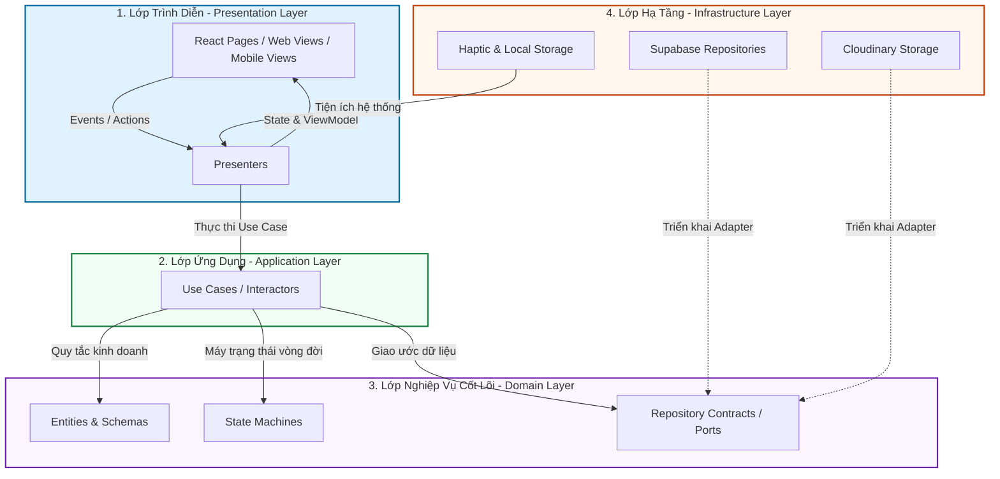

# 🗺️ BẢN ĐỒ KIẾN TRÚC MÔ-ĐUN: AUTO 28 SHOWROOM MANAGER
> **Dự án:** `auto-28` (Hệ Thống Quản Trị Showroom & Dòng Tiền SSoT)  
> **Framework:** Vite + React 18 + TypeScript + Tailwind CSS + Capacitor (iOS/Android)  
> **Mục tiêu:** Quản trị tập trung kho xe, dòng tiền thu chi, công nợ, hoa hồng sales, quyết toán bảng lương và ma trận phân quyền RBAC.

---

## 🏛️ 1. CẤU TRÚC PHÂN TẦNG CLEAN ARCHITECTURE & MVP (`src/modules/`)

```mermaid
graph TD
    subgraph PRESENTATION_LAYER [1. Lớp Trình Diễn - Presentation Layer]
        A1[React Pages / Web Views / Mobile Views] -->|Events / Actions| A2[Presenters]
        A2 -->|State & ViewModel| A1
    end

    subgraph APPLICATION_LAYER [2. Lớp Ứng Dụng - Application Layer]
        A2 -->|Thực thi Use Case| B1[Use Cases / Interactors]
    end

    subgraph DOMAIN_LAYER [3. Lớp Nghiệp Vụ Cốt Lõi - Domain Layer]
        B1 -->|Quy tắc kinh doanh| C1[Entities & Schemas]
        B1 -->|Máy trạng thái vòng đời| C2[State Machines]
        B1 -->|Giao ước dữ liệu| C3[Repository Contracts / Ports]
    end

    subgraph INFRASTRUCTURE_LAYER [4. Lớp Hạ Tầng - Infrastructure Layer]
        D1[Supabase Repositories] -.->|Triển khai Adapter| C3
        D2[Cloudinary Storage] -.->|Triển khai Adapter| C3
        D3[Haptic & Local Storage] -->|Tiện ích hệ thống| A2
    end

    style PRESENTATION_LAYER fill:#e0f2fe,stroke:#0369a1,stroke-width:2px
    style APPLICATION_LAYER fill:#f0fdf4,stroke:#15803d,stroke-width:2px
    style DOMAIN_LAYER fill:#faf5ff,stroke:#6b21a8,stroke-width:2px
    style INFRASTRUCTURE_LAYER fill:#fff7ed,stroke:#c2410c,stroke-width:2px
```

---

## 📂 2. MA TRẬN 9 MÔ-ĐUN NGHIỆP VỤ CỦA SHOWROOM MANAGER

| STT | Mô-đun Nghiệp Vụ | Cấu Trúc Phân Lớp | Vai Trò Nghiệp Vụ Chính | Tương Tác Phụ Thuộc (Dependencies) |
| :---: | :--- | :--- | :--- | :--- |
| **1** | **[`inventory`](file:///Users/phanvu/Desktop/auto-28/src/modules/inventory)** | Đầy đủ 4 lớp | Quản lý kho xe, vòng đời xe, trạng thái lưu kho, giá vốn và lịch sử sửa chữa. | `staff` (người nhập/bán), `finance` (ghi nhận chi phí phát sinh). |
| **2** | **[`finance`](file:///Users/phanvu/Desktop/auto-28/src/modules/finance)** | Đầy đủ 4 lớp | Dòng tiền SSoT, sổ cái chi phí tu bổ, định giá thu mua xe cũ, báo cáo lãi gộp. | `inventory` (dòng vốn xe), `staff` (hoa hồng & quyết toán lương). |
| **3** | **[`staff`](file:///Users/phanvu/Desktop/auto-28/src/modules/staff)** | Đầy đủ 4 lớp | Hồ sơ nhân sự, định mức hoa hồng, quản lý tạm ứng và duyệt hoàn ứng chi phí. | `payroll` (quyết toán lương), `inventory` (xe nhân viên phụ trách). |
| **4** | **[`payroll`](file:///Users/phanvu/Desktop/auto-28/src/modules/payroll)** | `domain`, `application` | Quyết toán bảng lương cuối tháng, tính toán tự động hoa hồng thực nhận. | `staff` (dữ liệu nhân sự), `finance` (quỹ tiền mặt chi lương). |
| **5** | **[`auth`](file:///Users/phanvu/Desktop/auto-28/src/modules/auth)** | Đầy đủ 4 lớp | Xác thực danh tính, phiên làm việc, quản lý ma trận phân quyền động (RBAC). | Cung cấp dịch vụ phân quyền toàn cục (`PermissionService`). |
| **6** | **[`user`](file:///Users/phanvu/Desktop/auto-28/src/modules/user)** | Đầy đủ 4 lớp | Quản lý tài khoản đăng nhập, hồ sơ người dùng, cấp phát và thu hồi quyền truy cập. | `auth` (xác thực quyền hạn Admin). |
| **7** | **[`personal`](file:///Users/phanvu/Desktop/auto-28/src/modules/personal)** | Chỉ `presentation` | Cổng thông tin tác nghiệp di động cho Sales/Thợ kiểm tra hoa hồng, nợ nần cá nhân. | Tái sử dụng Use Cases từ `staff` và `inventory`. |
| **8** | **[`dashboard`](file:///Users/phanvu/Desktop/auto-28/src/modules/dashboard)** | Chỉ `presentation` | Trung tâm chỉ huy điều hành, hiển thị biểu đồ KPI tài chính, tồn kho và tiến độ. | Sử dụng dữ liệu tổng hợp từ `finance` và `inventory` Presenters. |
| **9** | **[`sandbox`](file:///Users/phanvu/Desktop/auto-28/src/modules/sandbox)** | Chỉ `presentation` | Phòng thí nghiệm vật lý giao diện (Physics Lab), xác thực Token thị giác Liquid Glass và haptic. | Độc lập hoàn toàn, thuần túy trưng bày Design System. |

---

## ⚡ 3. BẢN ĐỒ TIÊM PHỤ THUỘC (IOC CONTAINER FLOW)

Mọi Repositories, Use Cases và Presenters được khởi tạo duy nhất tại [DependencyContext.tsx](file:///Users/phanvu/Desktop/auto-28/src/shared/ioc/DependencyContext.tsx):

```mermaid
flowchart LR
    subgraph RepoFactory [1. Khởi Tạo Repositories]
        R1[SupabaseVehicleRepository]
        R2[SupabaseStaffRepository]
        R3[SupabaseExpenseRepository]
        R4[CloudinaryVehicleStorageRepository]
    end

    subgraph UseCaseFactory [2. Hợp Nhất Use Cases]
        U1[GetInventoryList / AddVehicle]
        U2[UpdateVehicleStatus / DeleteVehicle]
        U3[GetMonthlyFinance / RecordExpense]
        U4[GetStaffList / ProcessSalaryPayment]
    end

    subgraph PresenterFactory [3. Factory Khởi Tạo Presenters]
        P1[InventoryPresenter]
        P2[FinancePresenter]
        P3[StaffPresenter]
        P4[UserManagementPresenter]
    end

    RepoFactory --> UseCaseFactory
    UseCaseFactory --> PresenterFactory
    PresenterFactory -->|useDependencies Hook| UI[React UI Components / Pages]
```

---

## 🔗 4. KẾT NỐI VỚI ỨNG DỤNG KIỂM ĐỊNH THỰC ĐỊA (`vinfast-check-app`)
* **`auto-28`** là **Trung tâm Đầu não (Core Showroom System)**.
* Khi đội thợ kiểm tra xe tại bãi bằng ứng dụng [vinfast-check-app](file:///Users/phanvu/Desktop/Check%20xe/vinfast-check-app), biên bản kiểm định 176 điểm và kết quả thẩm định từ `ai-engine` sẽ được đồng bộ vào kho xe của **`auto-28`** để tiến hành các thủ tục tài chính, định giá và bán lẻ.
