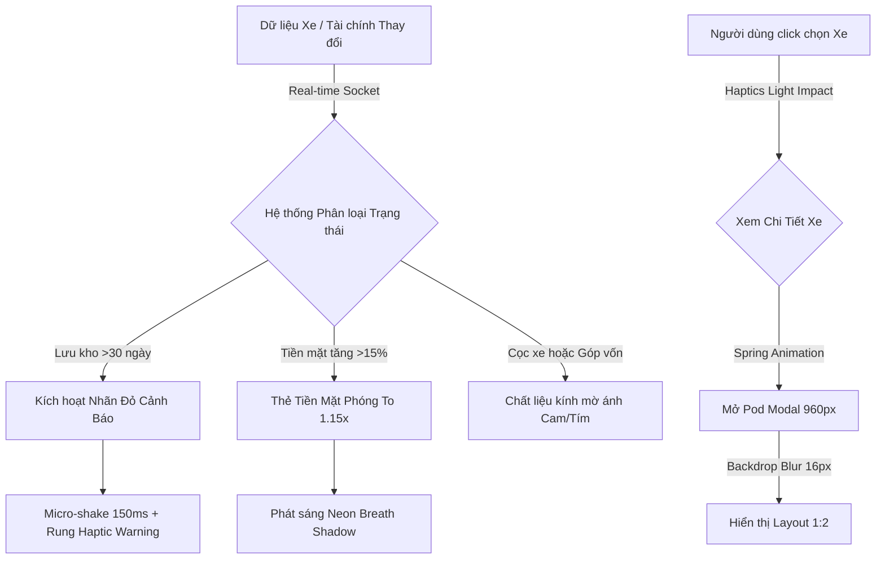

# ĐẶC TẢ THIẾT KẾ: NEURAL EXPRESSIVE DESIGN SYSTEM

**Dự án:** Giao diện Điều hành Thông minh Auto 28 Showroom Manager

**Phiên bản:** 2.0-Production (Neural Expressive & Liquid Glass Edition)

**Trạng thái hệ thống:** Động (Data-Driven) • Tự động phản hồi sinh học

---

## I. TRIẾT LÝ & NGUYÊN TẮC CỐT LÕI (DESIGN PRINCIPLES)

Tài liệu quy chuẩn kỹ thuật và khuôn mẫu trực quan này giúp dịch chuyển giao diện của Auto 28 Showroom Manager từ dạng cấu trúc tĩnh, hình khối cứng nhắc sang cấu trúc **"Dạng lỏng" (Fluid)**, chú trọng vào chuyển động vật lý lò xo, phân tầng nhận thức và tương tác đa phương thức bản địa của kỷ nguyên AI.

* **Tính Đa Phương Thức Bản Địa (Native Multimodality):** Giao diện xóa bỏ ranh giới của văn bản thô. Toàn bộ hệ thống được thiết lập để tiếp nhận và phản hồi song song bằng hình ảnh, âm thanh, video ngắn và phản hồi xúc giác (Haptic Feedback) bản địa.
* **Bố Cục Dạng Lỏng (Fluid Layout):** Triệt tiêu các khung lưới (Grid) cố định cứng nhắc. Các thành phần UI tự động co giãn, bung nở và dịch chuyển cấu trúc dựa trên khối lượng thông tin phản hồi từ mô hình AI và độ khẩn cấp của dữ liệu vận hành thời gian thực.
* **Thiết Kế Cảm Xúc & Sinh Học (Organic Physics, Motion & Empathic Feedback):** Loại bỏ các hiệu ứng diễn hoạt phẳng tuyến tính (Linear) cơ học. Giao diện mô phỏng các thực thể sống thông qua dải màu Gradient chuyển động chậm (Ambient) và hiệu ứng chuyển động có quán tính, đàn hồi, nén vật lý giống mô sinh học, tạo cảm giác hệ thống đang "suy nghĩ" hoặc "biết thở", giúp xoa dịu áp lực tâm lý cho người điều hành.

---

## II. HỆ THỐNG KIẾN TRÚC THỊ GIÁC (VISUAL SYSTEM)

### 1. Bảng màu biểu cảm & Chế độ Sáng/Tối song hành (Color & Depth Tokens)

Loại bỏ tư duy màu phẳng (Flat Color) đơn điệu. Neural Expressive sử dụng hệ thống màu sắc dựa trên vật liệu **Mờ kính (Translucency/Glassmorphism)**, hỗ trợ tối đa cho cả chế độ Sáng (Light) và Tối (Dark) để đảm bảo độ tương phản sinh học:

| Tầng lớp (Layer) | Chế độ Sáng (Light Mode Tokens) | Chế độ Tối (Dark Mode Tokens) | Hiệu ứng lớp kính & Đổ bóng | Ứng dụng thực tế trên Auto 28 |
| :--- | :--- | :--- | :--- | :--- |
| **Layer 0 (Canvas Background)** | `#F8FAF4` | `#0B0E14` | Kết hợp Ambient Gradient chuyển động chậm ở nền ngầm. | Nền tổng thể của Showroom Dashboard |
| **Layer 1 (Surface/Card)** | `rgba(255,255,255,0.75)` | `rgba(22,26,35,0.65)` | `backdrop-blur-xl`, Viền siêu mảnh: `border-black/5` hoặc `border-white/10` | Thẻ Báo Cáo, Thẻ Kho Xe, Modal Chi Tiết Xe |
| **Layer 2 (Nút / Pill / Input)** | `rgba(0,0,0,0.03)` | `rgba(255,255,255,0.05)` | Không mờ kính, khi tương tác (Hover) đổi màu sang độ bão hòa thấp (`opacity-10`) | Nút chuyển tab, bộ lọc trạng thái xe, Input tiền |
| **Layer 3 (Overlay / AI State)** | Dải màu gradient rực rỡ phát sáng (`#00F2FE` $\rightarrow$ `#4FACFE`) | Dải màu gradient sâu thẳm phát sáng | Bóng đổ diện rộng chống lóa: `shadow-2xl shadow-indigo-500/10` | Bong bóng trợ lý AI Blob, Thanh Live, Toast khẩn cấp |

#### Bảng tham chiếu lớp CSS Tailwind tương ứng (Tailwind Class Equivalents):
* **Layer 0 (Canvas Background):** `bg-[#F8FAF4]` (Light Mode) / `bg-[#0B0E14]` (Dark Mode) + `animate-ambient`.
* **Layer 1 (Card Surface):** `bg-white/70 backdrop-blur-xl border border-black/5 shadow-sm` (Light Mode) / `bg-[#161a23]/65 backdrop-blur-xl border border-white/8 shadow-sm` (Dark Mode).
* **Layer 2 (Interactive Pills/Inputs):** `bg-gray-50/50 hover:bg-indigo-50 border border-transparent hover:border-indigo-100` (Light Mode) / `bg-white/5 hover:bg-white/10` (Dark Mode).
* **Layer 3 (Overlay AI/Toasts):** `bg-gradient-to-r from-blue-500 via-purple-500 to-pink-500 shadow-xl shadow-indigo-500/10`.

#### Bảng màu Gradient tự phát sáng theo trạng thái dữ liệu (Ambient Glow):
* **Ổn định / Tích cực:** `#00F2FE` $\rightarrow$ `#4FACFE` (Neon Blue/Mint) - Phát sáng nhẹ biên độ thấp (`Breathe`) $\rightarrow$ Ứng dụng: Tiền mặt khả dụng, Biên độ dòng tiền dương (`+150 Tr`).
* **Cảnh báo / Khóa vốn:** `#FF0844` $\rightarrow$ `#FFB199` (Vibrant Coral/Amber) - Xung động nhẹ (`Pulse`) khi tương tác $\rightarrow$ Ứng dụng: Lợi ròng âm, Lưu kho lâu (`36-68 ngày`), `CỌC MUA`.
* **Trung tính / Trống:** `#FDFCFB` $\rightarrow$ `#E2DCD5` (Warm Bone) - Bề mặt nhám mờ, hấp thụ ánh sáng $\rightarrow$ Ứng dụng: Tiêu đề phụ, Các tab/nút chưa kích hoạt.

### 2. Bố cục & Khoảng cách động (Fluid Spacing & Layout Grid)

Hệ thống khoảng cách tuân thủ nghiêm ngặt **Hệ lưới động mềm (Fluid Soft Grid)** dựa trên bội số của `8px`. Các khoảng thở (Breathing space) lớn được ưu tiên để giảm tải áp lực thị giác cho người dùng:

* **Độ bo góc thẻ (Border Radius):** Sử dụng các góc bo cực đại để triệt tiêu hoàn toàn cảm giác sắc nhọn cơ học:
  * Khung thẻ lớn (Main Cards / Modals): `rounded-[32px]` (`32px` hoặc đường cong Super Ellipse mượt mà).
  * Thành phần con bên trong (Internal Elements/Images): `rounded-[20px]` đến `rounded-[24px]`.
  * Thanh điều khiển / Nút bấm (Pills/Buttons): `rounded-full` (`9999px` hình viên thuốc hoàn hảo).
* **Khoảng đệm nội dung (Padding):**
  * Đệm viền tổng thể của thẻ: Tối thiểu `p-6 (24px)`, lý tưởng là `p-8 (32px)` để các phần tử bên trong thở tốt.
  * Khoảng cách giữa các thẻ trong lưới (Grid Gap): `gap-6 (24px)` hoặc `gap-8 (32px)`.
* **Khoảng cách thành phần con (Gap Spacing):**
  * Giữa Tiêu đề và Mô tả ngắn: `gap-1 (4px)` hoặc `gap-2 (8px)`.
  * Giữa khối chữ và khối hình ảnh/biểu đồ nhúng: `gap-4 (16px)` hoặc `gap-6 (24px)`.

### 3. Quy hoạch độ sâu trực giác (Neural Z-Index Shadows)

Hệ thống ánh xạ trực tiếp 4 tầng kiến trúc chiều sâu rõ rệt tương ứng với 4 Layer màu sắc song hành:

```
[TẦNG 4: TOP]  ➔ Layer 3 (AI Blob, Toasts, Live Pod) (Z-Index: 9999) | Shadow: Tỏa sáng Neon 40px hoặc shadow-indigo-500/10
[TẦNG 3: MID]  ➔ Layer 1 (Modal Chi tiết xe, Thẻ Tiền Mặt Phóng To) (Z-Index: 500) | Shadow: Soft Dark 24px
[TẦNG 2: BASE] ➔ Layer 1 (Thẻ Báo Cáo Tiêu Chuẩn & Thẻ Kho Xe) (Z-Index: 100) | Shadow: Claymorphism 12px
[TẦNG 1: BG]   ➔ Layer 0 (Mặt nền Canvas Xám Nhạt Hệ Thống) (Z-Index: 0)     | Không đổ bóng
```

* **Mã Shadow Tầng 2 (Tiêu chuẩn):** `box-shadow: inset 2px 2px 5px rgba(255,255,255,0.7), 8px 8px 16px rgba(0,0,0,0.06);` (Claymorphism cho Light Mode).
* **Mã Shadow Tầng 3 (Kích hoạt dòng tiền dương):** `box-shadow: 0px 20px 40px rgba(79, 172, 254, 0.25);`

### 4. Hệ thống kiểu chữ chuẩn hóa (Typography Scale)

Áp dụng **Quy tắc 2 Giây (Bold-First)**: Đẩy toàn bộ độ tương phản vào tiêu đề chính để hỗ trợ người dùng đọc lướt, xóa bỏ hoàn toàn các "bức tường văn bản" dài dằng dặc gây mệt mỏi cho nhà quản lý showroom.
*Phông chữ đề xuất & Phối hợp (Font Pairings):*
* **Font Tiêu đề & Chỉ số (font-display):** `Plus Jakarta Sans` (khai báo `font-display`) - Được tối ưu đặc trưng cho các nhãn in đậm, số liệu tài chính lớn, tạo độ khỏe khoắn và sắc nét cao độ.
* **Font Văn bản & Giải trình (font-sans):** `Be Vietnam Pro` (khai báo `font-sans`) - Mang lại trải nghiệm đọc dễ chịu, hỗ trợ tiếng Việt hoàn hảo cho các phần mô tả dòng tiền, báo cáo của AI.

| Thành phần chữ | Kích thước (Pixel) | Độ dày chữ (Weight) | Khoảng cách chữ (Letter Spacing) | Mã Tailwind ứng dụng | Giá trị Line-Height & Ứng dụng |
| :--- | :--- | :--- | :--- | :--- | :--- |
| **Số liệu lớn (Metrics)** | `32px` - `40px` | `Black (900)` | Thắt chặt (`-0.05em`) | `text-4xl font-black tracking-tighter` | `leading-[1.1]` ($44\text{px}$) - Giúp số tài chính/kho vận khít lại như khối vững chắc. |
| **Tiêu đề Thẻ (Card Title)**| `20px` - `24px` | `Black (900)` | Thu hẹp (`-0.025em`) | `text-xl font-black tracking-tight` | `leading-[1.25]` ($30\text{px}$) - Tiêu đề xe, Tiêu đề phân khu điều hành chính. |
| **Tiêu đề con (Subtitle)** | `18px` | `Bold (700)` | Hơi thu hẹp (`-0.01em`) | `text-lg font-bold tracking-tight` | `leading-[1.3]` ($24\text{px}$) - Tiêu đề thẻ con / nhóm chức năng phụ. |
| **Văn bản phụ (Subtitle Sm)** | `14px` - `15px` | `Medium (500)` | Bình thường (`0`) | `text-sm font-medium text-gray-500` | `leading-[1.4]` ($20\text{px}$) - Ghi chú phụ, Chữ chú thích bên dưới thẻ hoặc mốc thời gian. |
| **Đoạn văn phản hồi (Body)**| `16px` | `Regular (400)` | Bình thường (`0`) | `text-base text-gray-600 leading-relaxed` | `leading-relaxed` hoặc `leading-[1.6]` ($26\text{px}$) - Đoạn văn giải trình dòng tiền do AI sinh. |
| **Nhãn viên thuốc (Tag/Pill)**| `12px` | `Bold (700)` | Mở rộng (`0.1em`) | `text-xs font-bold tracking-widest uppercase` | `leading-[1]` ($12\text{px}$) - Nhãn `CỌC MUA`, `TRONG KHO`, giúp chữ in hoa căn giữa hình học viên thuốc. |

---

## III. THIẾT KẾ CHI TIẾT CÁC THÀNH PHẦN (COMPONENT SPECIFICATIONS)

### 1. Thanh điều hướng thông minh (Neural Navigation Bar)

Thanh điều hướng được thiết kế dạng một "Floating Pod" (Kén nổi) nằm ở rìa trên màn hình.

* **Tổng kích thước thanh Pod:** Cao $64\text{px}$, Chiều rộng tự động co giãn theo Viewport ($1200\text{px} - 1600\text{px}$).
* **Các Tab điều hướng (`BÁO CÁO`, `KHO XE`...):** Kích thước vùng bấm Rộng $120\text{px} \times$ Cao $44\text{px}$. Bo góc $12\text{px}$ (Dạng Squircle mượt mà).
* **Hiệu ứng Liquid:** Khi người dùng di chuột hoặc chuyển tab, một "giọt nước năng lượng" (Fluid Indicator) cao $4\text{px}$ sẽ mượt mà chảy từ tab này sang tab khác thay vì chỉ đổi màu đột ngột.
* **Trạng thái User:** Khu vực hiển thị `Phan Hữu Hoài Vũ - QUẢN LÝ SHOWROOM`. Avatar chữ `P` được bao bọc bởi một vòng tròn viền gradient chuyển động xoay nhẹ (chu kỳ 6 giây).

### 2. Khối Trung tâm Điều hành Tài chính (Báo cáo Tổng lực)

Áp dụng nguyên lý **Tự động Phân cấp Thị giác** cho các thẻ cốt lõi dựa trên dữ liệu:

* **Thẻ trạng thái tiêu chuẩn (Lợi nhuận gộp, Xe nhập mới...):** Rộng $320\text{px} \times$ Cao $180\text{px}$. Bo góc $24\text{px}$. Icon tròn phía trên đường kính $44\text{px}$ cố định.
* **Thẻ phóng to theo dữ liệu (Tiền mặt khả dụng):** Tự động nhân tỷ lệ vàng, kích thước tăng 15% lên mức Rộng $368\text{px} \times$ Cao $196\text{px}$. Tỏa ra quầng sáng xanh an toàn để làm dịu tâm lý người xem. Cỡ chữ số phóng to lên $36\text{pt}$ (Bold).
* **Thẻ cảnh báo co giãn (Lợi ròng cuối âm, Tồn kho lâu):** Bị bóp nhỏ bề ngang còn $300\text{px}$ để tạo hiệu ứng "nén áp lực". Đường viền chạy dải màu Gradient Coral dày $1.5\text{px}$ nhấp nháy phát tín hiệu ở tần số thấp.

### 3. Khối Danh Sách Công Nợ (Accounts Receivable & Payable)

Danh sách nợ được chia thành các dải mô-đun dạng sóng mềm.

* **Dải Nợ Phải Thu (Thẻ Đơn - VF5 Plus):** Rộng $100\%$ khung chứa $\times$ Cao $72\text{px}$. Cạnh góc bo $16\text{px}$.
* **Dải Nợ Phải Trả (Thẻ Tổng hợp):** Khung cha tự động mở rộng theo dữ liệu (Min-Height: $320\text{px}$). Các thẻ xe thành phần bên trong cao cố định $64\text{px}$, cách nhau $12\text{px}$. Các khoản nợ lâu từ tháng trước sẽ tự động giảm độ bão hòa màu sắc (Saturation) xuống $10\%$ để báo hiệu dòng tiền tù đọng.

### 4. Hệ thống Thẻ xe (Neural Vehicle Cards - Tab Kho Xe)

* **Kích thước tiêu chuẩn (Grid View):** Rộng $340\text{px} \times$ Cao $420\text{px}$. Bo góc $24\text{px}$ (Squircle).
* **Vùng hiển thị hình ảnh (Media Zone):** Cao $180\text{px}$, bo góc trong $16\text{px}$.
* **Hệ thống Nhãn trạng thái (Expressive Tags & Typography):**
  * **Nhãn `TRONG KHO`:** Kích thước $96\text{px} \times 24\text{px}$, chữ $11\text{pt}$ (Semi-Bold). Nền xanh lá tỏa hiệu ứng mạch đập nếu số ngày lưu kho lý tưởng ($<30\text{ ngày}$).
  * **Nhãn `CỌC MUA` / `CỌC TRẢ THẲNG`:** Kích thước tự động dãn từ $96\text{px} \rightarrow 120\text{px}$. Chữ bắt buộc đưa về kích thước chuẩn **$11\text{pt}$ (hoặc $12\text{px}$)**, kiểu chữ **Semi-Bold (Trọng lượng 600)**, tăng khoảng cách chữ (`letter-spacing: 0.05em`). Nền chuyển sang chất liệu kính mờ ánh cam/tím. Khi hover, chữ tự động chuyển sắc sang dải màu tím ánh bạc trong vòng $180\text{ms}$.
  * **Chỉ số ngày lưu kho dữ liệu (`68d`, `37d`):** Nếu vượt hạn mức $30\text{ ngày}$, font chữ tự động tăng trọng số lên **Extra Bold**, chuyển sang sắc đỏ san hô (`#FF0844`) và kích hoạt hiệu ứng rung nhẹ (Micro-shake).

### 5. Cửa sổ Modal Chi tiết Xe (The Pod Modal Popup)

Xuất hiện khi người dùng xem chi tiết một chiếc xe (Ví dụ: Toyota Altis HEV).

* **Kích thước tổng:** Rộng $960\text{px} \times$ Cao $680\text{px}$. Bo góc $32\text{px}$. Nền mờ diện rộng `backdrop-filter: blur(16px)`.
* **Cấu trúc chia khối (Layout Split - Tỷ lệ 1:2):**
  * **Cột trái (Tổng quan nhanh):** Rộng $280\text{px}$. Thẻ Lợi nhuận dự kiến (`150 Tr`) chữ màu xanh Mint, đi kèm icon đồ thị ($\nearrow$) tự động phát sáng nhẹ. Thẻ Tổng vốn (`647 Tr`) chữ màu đen sâu, icon ($\$$) xanh dương trầm biểu thị vốn cố định, an toàn.
  * **Cột phải (Nội dung chi tiết):** Rộng $680\text{px}$. Thanh điều hướng tab phụ (`THÔNG SỐ`, `TÀI CHÍNH`...) cao $36\text{px}$, khi bấm có vệt sáng chạy ngầm dưới chân tab ($200\text{ms}$). Khối đồng hồ lưu kho (`36 NGÀY`) tự động phình to chữ số lên $20\%$ và đổi sang màu cam hổ phách do đã vượt ngưỡng an toàn. Ô giá chào bán target (`800 Tr`) rộng $160\text{px} \times$ cao $72\text{px}$ có viền phát sáng xanh lá độc quyền.

### 6. Hệ thống Thông báo Biểu cảm (Neural Toast Notifications)

Kén thông báo tự động phát ra từ thanh điều hướng chính (Top Navigation Pod) như một tế bào phân chia khi có biến động dữ liệu real-time.

* **Kích thước vật lý:** Rộng $340\text{px} \times$ Cao $56\text{px}$. Bo góc $28\text{px}$ (Hình giọt nước hai đầu).
* **Vị trí:** Thả trôi tự do tại tọa độ cách mép trên màn hình $80\text{px}$, căn giữa tuyệt đối theo chiều ngang. Tự động thu nhỏ scale về 0 để tiêu biến sau 4 giây.

### 7. Thiết kế Nút bấm & Công cụ lọc (Action Buttons)

* **Nút [XUẤT BÁO CÁO]:** Kích thước tĩnh Rộng $180\text{px} \times$ Cao $48\text{px}$. Bo góc oval tuyệt đối. Khi Hover, chiều rộng dãn ra $192\text{px}$, chiều cao nén dẹt lại $46\text{px}$ (Hiệu ứng co dãn chất lỏng).
* **Nút Bộ lọc [Trong kho / Đã bán]:** Kích thước tổng Rộng $220\text{px} \times$ Cao $40\text{px}$. Khi bấm chuyển đổi, khối nền đen (Active state) áp dụng hiệu ứng `Stretchy Fluid` - co dãn kéo dài xuyên qua nút bên cạnh giống như nam châm dẻo thay vì tắt/mở đột ngột.
* **Nút Đóng Modal [X]:** Nằm ở góc phải trên, vùng chạm $32\text{px} \times 32\text{px}$. Khi hover, icon $[X]$ tự động xoay một góc $90^\circ$ mượt mà.

### 8. Thành Phần Trợ Lý Thần Kinh (Neural AI Blob Component)

Nằm cố định ở góc phải dưới cùng màn hình, hoạt động độc lập với lưới grid.

* **Kích thước khối Liquid Blob:** Đường kính dao động tự do từ $56\text{px} \rightarrow 64\text{px}$ (AI liên tục thay đổi hình dáng chất lỏng 3D để biểu thị tư duy).
* **Bong bóng lời thoại (AI Tooltip):** Rộng tối đa $280\text{px}$, chất liệu kính mờ đục `backdrop-filter: blur(20px)`, bo góc $20\text{px}$. Ngôn ngữ hiển thị dạng trò chuyện thấu cảm, đưa ra các giải pháp giải tỏa áp lực tài chính cho người điều hành.

### 9. Quy chuẩn hình học và kích thước thẻ Card (Card Dimensions Specifications)

Ngôn ngữ thiết kế này quy chuẩn hóa kích thước thẻ dựa trên hệ thống "Lưới động tỷ lệ" (Breakpoint-Based Fluid Grid). Kích thước thẻ được phân chia thành 4 nhóm tương ứng với 4 kịch bản giao diện cụ thể:

#### a. Thẻ Nhỏ (Small Card / Metric & Widget Card)
* **Mục đích:** Hiển thị một chỉ số đơn lẻ (ví dụ: Tổng doanh thu, Nhiệt độ), hoặc một nút công cụ AI nhanh (Tạo ảnh, Tạo nhạc).
* **Chiều rộng (Width):** Cố định từ 240px đến 280px. Không kéo giãn quá 300px để tránh loãng thông tin.
* **Chiều cao (Height):** Thường khóa theo tỷ lệ hình vuông 1:1 hoặc 4:3. Kích thước cao lý tưởng là 180px đến 240px.
* **Padding nội bộ:** Khóa cứng ở mức p-5 (20px) cho cả 4 cạnh để tối ưu không gian hiển thị con số lớn.

#### b. Thẻ Trung bình (Medium Card / Product & Content Feed)
* **Mục đích:** Thẻ hiển thị sản phẩm mua sắm, bài viết gợi ý từ AI, hoặc luồng tin tức tổng hợp.
* **Chiều rộng (Width):** Tự động co giãn (Responsive) trong khoảng từ 320px đến 380px.
* **Chiều cao (Height):** Áp dụng nghiêm ngặt Tỷ lệ căn bậc hai của 2 (1 : 1.414) để tạo độ thanh thoát như một trang sách. Chiều cao tương ứng sẽ dao động từ 450px đến 530px.
* **Padding nội bộ:** Thiết lập mức p-6 (24px). Riêng phần hình ảnh bên trong phải cách lề trái/phải/trên đúng 16px và cách khối chữ bên dưới 20px.

#### c. Thẻ Lớn (Large Card / Dashboard Analytics & Canvas)
* **Mục đích:** Chứa biểu đồ dữ liệu phức tạp, không gian thiết kế Canvas, hoặc khung cửa sổ chat hội thoại chính của Gemini.
* **Chiều rộng (Width):** Chiếm diện tích tối thiểu 560px và có thể co giãn tràn màn hình lên tới 760px (ở màn hình Desktop lớn).
* **Chiều cao (Height):** Áp dụng tỷ lệ điện ảnh 16:9 hoặc tỷ lệ vàng nằm ngang 1.618 : 1. Chiều cao tiêu chuẩn được khóa ở mức 380px đến 480px.
* **Padding nội bộ:** Sử dụng khoảng thở tối đa p-8 (32px) để các khối dữ liệu, đường đồ thị không chạm sát viền thẻ.

#### d. Quy chuẩn CSS Grid & Thiết kế Đáp ứng Toàn diện (Fluid Responsive Grid)
Để hệ lưới tự động thích ứng tối ưu hiển thị đa thiết bị mà không bị vỡ cấu trúc hình học, hãy sử dụng đoạn mã CSS khóa biên độ sau:

```css
/* Lưới chứa tự động xuống dòng và co giãn */
.expressive-grid-container {
    display: grid;
    grid-template-columns: repeat(auto-fit, minmax(280px, 1fr));
    gap: 24px;
}

/* Khóa tỷ lệ căn bậc hai của 2 cho thẻ sản phẩm/thẻ bài viết dọc */
.expressive-vertical-card {
    width: 100%;
    max-width: 420px;
    aspect-ratio: 1 / 1.414;
}

.expressive-card-grid {
  display: grid;
  /* Thẻ tự động co giãn từ tối thiểu 320px đến tối đa 1 phần bằng nhau của hàng */
  grid-template-columns: repeat(auto-fit, minmax(320px, 1fr));
  gap: 28px; /* Khoảng cách đại diện giữa các thẻ */
}
```

#### e. Đoạn mã triển khai hoàn chỉnh (Mẫu Card đã được đo kích thước chính xác thực tế)
Dưới đây là một đoạn mã HTML cấu trúc một Thẻ Trung bình (Medium Card) áp dụng chính xác từng pixel thông số kích thước card và font chữ kể trên, bạn có thể đưa ngay vào sản phẩm web của mình:

```html
<!-- Chiều rộng được khóa trong biên độ 340px, bo góc cực đại 32px -->
<div class="w-[340px] aspect-[1/1.414] bg-white border border-black/5 rounded-[32px] p-6 shadow-sm flex flex-col justify-between">
  
  <div>
    <!-- Cấp độ 6: Nhãn viên thuốc (12px, Bold, Uppercase, Tracking-widest) -->
    <span class="text-[12px] font-bold tracking-widest text-indigo-600 uppercase block mb-2">
      Phân Tích Thống Kê
    </span>
    
    <!-- Cấp độ 2: Tiêu đề thẻ (24px, Black, Tracking-tight, Line-height 1.25) -->
    <h3 class="text-[24px] font-black text-gray-900 tracking-tight leading-[30px] mb-3">
      Hiệu suất chuyển đổi tăng vọt 34%
    </h3>
    
    <!-- Cấp độ 4: Đoạn văn bản chính (16px, Normal, Line-height 1.6) -->
    <p class="text-[16px] font-normal text-gray-600 leading-[26px]">
      Hệ thống trí tuệ nhân tạo phát hiện lưu lượng truy cập từ các chiến dịch tự động đạt tỷ lệ giữ chân khách hàng cao kỷ lục trong tuần qua.
    </p>
  </div>

  <!-- Khu vực hành động dưới đáy thẻ, khoảng cách thoáng đạt -->
  <div class="flex items-center justify-between pt-4 border-t border-gray-100">
    <!-- Cấp độ 5: Chữ mô tả phụ (14px, Medium, Line-height 1.4) -->
    <span class="text-[14px] font-medium text-gray-400 leading-[20px]">
      Cập nhật 2 phút trước
    </span>
    <button class="bg-black text-white px-5 py-2.5 rounded-full text-[12px] font-bold hover:bg-indigo-600 transition-all active:scale-95">
      Xem Báo Cáo
    </button>
  </div>
</div>
```

---

### 10. Trạng thái Trực quan của AI (AI States & Interleaved Feedback Loops)

Giao diện của Auto 28 biểu thị rõ ràng hành vi tư duy sinh học và vòng phản hồi đa tầng của AI thông qua chuyển động của dải màu gradient bong bóng nền và các lớp phủ phát sáng:
1. **Trạng thái Chờ / Nhập liệu (Idle / Prompting):** Hệ màu tĩnh, dải màu gradient ở hộp nhập liệu hình viên thuốc đứng im, nét mảnh nhẹ nhàng không gây xao nhãng.
2. **Trạng thái Tư duy (Thinking / Processing):** Nền thẻ phản hồi hoặc thanh viên thuốc chạy hiệu ứng quét ánh sáng chuyển động nhịp nhàng (Shimmer hiệu ứng sóng âm chậm `breathe-glow`) mô phỏng nhịp thở sâu sinh học.
3. **Trạng thái Xuất dữ liệu (Streaming / Responding):** Chữ và các khối dữ liệu nhúng (Biểu đồ tài chính, Timeline công nợ) xuất hiện nối đuôi nhau (Staggered Animation) từ trên xuống dưới một cách mượt mà, không giật cục nhờ bộ tăng tốc đồ họa phần cứng.
4. **Trạng thái Lỗi / Cảnh báo (Error / Limit Exceeded):** Viền của hộp nhập liệu chuyển sang dải màu gradient Coral đỏ hổ phách kèm hoạt ảnh vi rung lắc cơ học (`animate-micro-shake`) và kích hoạt phản hồi xúc giác Warning Haptic trên thiết bị di động.

---

### 11. Linh Kiện Cốt Lõi: Thanh "Viên Thuốc" Đa Năng (The Unified Pill Menu Component)

Đây là linh kiện tương tác cốt lõi nhất của ngôn ngữ thiết kế Neural Expressive, tích hợp hộp nhập liệu thông minh, nút "+" đa năng thu gọn và thanh chuyển đổi giọng nói (Gemini Live Inline) độc quyền cho Auto 28 Showroom Manager [9to5Google]:

#### a. Mã nguồn HTML & Tailwind CSS minh họa cấu trúc:
```html
<!-- Cửa sổ nhập liệu trung tâm dạng viên thuốc -->
<div class="w-full max-w-2xl bg-white/80 dark:bg-[#161a23]/80 backdrop-blur-xl border border-black/5 dark:border-white/10 rounded-[32px] p-3 shadow-xl flex items-center gap-3">
  
  <!-- Nút "+" đa năng hợp nhất (Unified Plus Button) -->
  <button class="w-12 h-12 rounded-full bg-gray-100 dark:bg-white/5 flex items-center justify-center text-xl font-bold text-gray-600 dark:text-gray-300 hover:scale-105 active:scale-95 transition-all">
    +
  </button>
  
  <!-- Ô nhập liệu Text -->
  <input type="text" placeholder="Hỏi Gemini hoặc nhập công cụ..." class="flex-1 bg-transparent border-none outline-none text-base text-gray-900 dark:text-white placeholder-gray-400 px-2" />
  
  <!-- Thanh viên thuốc Gemini Live Inline (Voice Toggle Button) -->
  <button class="bg-gradient-to-r from-blue-500 via-purple-500 to-pink-500 text-white px-5 py-2.5 rounded-full text-xs font-black tracking-tight hover:opacity-90 active:scale-95 transition-all flex items-center gap-2 shadow-lg shadow-purple-500/20">
    <span class="w-2 h-2 rounded-full bg-white animate-ping"></span>
    Live
  </button>
</div>
```

---


## IV. TOKENS CHUYỂN ĐỘNG SINH HỌC (MOTION & TIMING TOKENS)

Toàn bộ hoạt ảnh trong hệ thống Auto 28 được cấu hình dựa trên các hàm toán học mô phỏng chuyển động lò xo và áp lực chất lỏng, loại bỏ hoàn toàn các chuyển động tuyến tính cơ học:

### 1. Học thuyết Chuyển động lò xo (Spring Timing Rules)
Hệ thống sử dụng hằng số thời gian lò xo chuẩn để mô phỏng sự đàn hồi tự nhiên của vật lý cơ học.

#### a. Mã CSS thuần (Pure CSS) dùng chung toàn cục:
Hãy khai báo biến lò xo toàn cục trong tệp cấu hình CSS chính của showroom:
```css
:root {
  --expressive-spring-curve: cubic-bezier(0.34, 1.56, 0.64, 1);
  --expressive-spring-duration: 400ms;
}

.neural-spring-card {
  transition: transform var(--expressive-spring-duration) var(--expressive-spring-curve),
              box-shadow var(--expressive-spring-duration) ease;
}
```

* **Hàm `Fluid-Slide` (Dùng cho điều hướng Tab & Dịch chuyển khung chứa):**

$$cubic-bezier(0.25, 1, 0.5, 1)$$

*(Tăng tốc cực nhanh ở $25\%$ đầu tiên, sau đó rê mượt và hãm phanh êm dịu ở đích đến).*

* **Hàm `Elastic-Pop` (Dùng cho Hover nút bấm, Thẻ dữ liệu phình to & Pop-in Modal):**

$$cubic-bezier(0.68, -0.6, 0.32, 1.6)$$

*(Hiệu ứng kéo đàn hồi: Khối sẽ hơi co lại một chút trước khi búng mạnh ra vượt quá kích thước đích rồi mới ổn định lại).*

### 2. Hiệu ứng Phản hồi lực nén & Trạng thái tương tác (Press Compression & Tactile Feedback)
Các phần tử tương tác trực tiếp (Hover/Active) phải tạo cảm giác nảy cơ học giống như nút bấm cao su hoặc mô sinh học đàn hồi:

* **Trạng thái Hover (Rê chuột/Tiếp cận):** Vật thể tăng kích thước nhẹ từ `scale-100` lên `scale-[1.02]` đến `scale-[1.03]` và giảm đổ bóng mờ ra diện rộng để giả lập hành vi vật thể tiến gần lại phía mắt người dùng.
* **Trạng thái Active (Bấm/Chạm):** Vật thể lập tức co nhỏ về mức `scale-[0.95]` đến `scale-[0.98]` và triệt tiêu toàn bộ bóng đổ để giả lập hành vi vật thể bị ấn lún sát xuống bề mặt màn hình.
* **Trạng thái Bung nở (Fly-out/Expansion):** Khi một danh sách hoặc cửa sổ hội thoại được kích hoạt, nó phải trượt từ dưới lên hoặc từ tâm nở ra theo trục tọa độ kèm theo hiệu ứng nảy vượt đích (Overshoot) nhẹ ở cuối hành trình.

```css
/* Hiệu ứng nảy lò xo khi hover và nén dẹt khi nhấn */
.card-interact:hover {
    transform: translateY(-4px) scale(1.02);
    box-shadow: 0px 20px 40px rgba(0, 0, 0, 0.08);
}
.card-interact:active {
    transform: scale(0.96);
    box-shadow: none;
}
```

### 3. Biên độ thời gian tiêu chuẩn (Duration Tokens)

* **Micro-interaction (Hover nút, chạm icon, tag):** $180\text{ms}$.
* **Card-Morphing (Khi thẻ biến đổi kích thước hoặc tìm kiếm bộ lọc xe):** $250\text{ms} - 450\text{ms}$ (Chuyển động có trọng lượng, mô phỏng khối thạch dẻo dãn nở).
* **Page/Modal-Transition (Khi đóng/mở chi tiết xe hoặc chuyển đổi tab lớn):** $300\text{ms} - 600\text{ms}$ (Áp dụng hiệu ứng thác nước - Waterfall cascade effect).

---

## V. CẤU KIỆN BIỂU MẪU TƯƠNG TÁC (INTERACTIVE FORM ELEMENTS - NEURAL INPUTS)

### 1. Khối nhập tiền thông minh (SmartAmountInput Component)

Khối nhập các chỉ số tiền giao dịch lớn (lên tới hàng trăm triệu/tỷ đồng) đòi hỏi sự kiểm soát tối đa và tránh sai sót nhập số 0.

* **Trạng thái bình thường:** Chiều cao cố định $56\text{px}$, bo góc $16\text{px}$ (T3). Nền kính mờ đặc `bg-white/70` để đảm bảo độ tương phản của chữ số.
* **Hiệu ứng Morphing biểu cảm:**
  * Khi người dùng bắt đầu nhập số, một dòng mô tả diễn giải bằng chữ tiếng Việt (ví dụ: *"Tám trăm triệu đồng"*) tự động trượt ra từ đáy Input với hiệu ứng `Fluid-Slide` trong $200\text{ms}$. Dòng chữ diễn giải này sử dụng màu xanh Mint rực rỡ để mang lại cảm xúc an toàn, chính xác.
  * Nếu người dùng nhập sai định dạng hoặc số tiền vượt định mức cảnh báo dòng vốn của showroom, viền Input lập tức đổi sang dải màu gradient Coral đỏ hổ phách và thực hiện xung động rung cơ học (`Micro-shake` trong $150\text{ms}$) để cảnh báo xúc giác.

### 2. Bộ chọn trạng thái xe (Interactive State Selector)

* **Thiết kế cơ học cũ:** Menu thả xuống (Dropdown) đơn điệu.
* **Nâng cấp Neural Expressive:** Bộ chọn được thiết kế như các "hạt năng lượng" nổi nằm ngang. Khi một hạt (ví dụ: `Trong kho`) được kích hoạt, nó phình to nhẹ $10\%$, nền kính chuyển từ trong suốt sang ánh màu tương ứng (Xanh lá mạch đập cho `Trong kho`, hổ phách sáng cho `Cọc mua`). Các hạt chưa được chọn tự động trượt lùi ra sau và giảm độ bão hòa xuống $15\%$.

---

## VI. BẢN ĐỒ PHẢN HỒI XÚC GIÁC (MOBILE HAPTIC FEEDBACK MATRIX)

Đối với các thiết bị di động chạy ứng dụng thông qua Capacitor iOS/Android, phản hồi vật lý từ mô-tơ rung (Haptic Engine) là cầu nối quan trọng của sự thấu cảm thiết kế.

| Hành động người dùng | Loại Haptic (Capacitor) | Mô tả vật lý (Tactile Feel) | Mục đích thiết kế |
| --- | --- | --- | --- |
| **Bấm nút/Chuyển Tab** | `Haptics.impact({ style: ImpactStyle.Light })` | Rung nhẹ, dứt khoát cực ngắn | Xác nhận hành động bấm vật lý thành công. |
| **Nhập liệu / Nhảy ký tự** | `Haptics.selection()` | Rung siêu nhẹ theo nhịp gõ | Mô phỏng tiếng gõ phím cơ học cao cấp. |
| **Vuốt thẻ / Ghim xe (Card Swipe/Pin)** | `Haptics.impact({ style: ImpactStyle.Medium })` | Rung trung bình, dứt khoát rõ rệt | Phản hồi xúc giác lực kéo vật lý trung bình. |
| **Nhấn sâu / Giữ lâu xem trước (Deep Click/Long Press)** | `Haptics.impact({ style: ImpactStyle.Heavy })` | Rung mạnh, đầm tay, có quán tính | Tạo cảm giác bứt phá giới hạn chiều sâu giao diện. |
| **Xác nhận giao dịch thành công (Lưu cọc, thanh toán)** | `Haptics.notification({ type: NotificationType.Success })` | Rung kép nhịp điệu nhanh dần | Giải tỏa căng thẳng, xác nhận dòng vốn đã an toàn. |
| **Cảnh báo lỗi/Vượt hạn mức lưu kho xe (>30 ngày)** | `Haptics.notification({ type: NotificationType.Warning })` | Rung 3 nhịp mạnh cách quãng ngắn | Thu hút sự chú ý lập tức của người quản trị showroom. |
| **Lỗi nghiêm trọng / Sập hệ thống (System Crash)** | `Haptics.notification({ type: NotificationType.Error })` | Rung liên hồi kéo dài, cường độ cao | Tín hiệu báo động đỏ, lỗi kết nối hoặc mất dữ liệu. |

---

## VII. TỐI ƯU HÓA HIỆU NĂNG CHUYỂN ĐỘNG (GPU ACCELERATION & MOTION PERFORMANCE)

Để duy trì tốc độ khung hình mượt mà $60\text{fps}$ trên các thiết bị di động có cấu hình phần cứng trung bình, toàn bộ chuyển động sinh học và hiệu ứng kính mờ (Backdrop Blur) phải tuân thủ nghiêm ngặt các quy tắc kỹ thuật sau:

1. **GPU Promotion:** Mọi phần tử sử dụng hoạt ảnh hoặc hiệu ứng kính mờ (ví dụ: thẻ `CarCard` khi hover hay `The Pod Modal`) bắt buộc phải gắn các thuộc tính thúc đẩy xử lý phần cứng:
   ```css
   will-change: transform, backdrop-filter;
   transform: translateZ(0);
   ```
2. **Không lạm dụng JS Animation:** Các chuyển động đàn hồi của thẻ card được xử lý hoàn toàn qua CSS Transitions hoặc bộ tăng tốc CSS GPU của Framer Motion. Tuyệt đối không sử dụng các vòng lặp Javascript `requestAnimationFrame` thủ công gây nghẽn luồng xử lý chính (Main Thread).
3. **Optimized Backdrop Blur:** Hạn chế sử dụng độ mờ vượt quá `backdrop-filter: blur(20px)` trên các phần tử di động. Giới hạn số lượng thẻ có hiệu ứng kính mờ hiển thị đồng thời trên một màn hình không quá 8 phần tử. Các phần tử khuất màn hình bắt buộc phải tắt hiệu ứng blur để giải phóng bộ nhớ RAM đồ họa.

---

## VIII. BẢN ĐỒ DỮ LIỆU XE THỰC TẾ & KHÔNG GIAN BIỂU CẢM (REAL DATA MAPPING)

Hệ thống tự động quét và phân loại danh sách xe hiện tại trong tab **KHO XE** thành các nhóm năng lượng thị giác khác nhau để người quản lý showroom nắm bắt trạng thái tài sản ngay lập tức:

### 1. Nhóm Dòng tiền Bị khóa (Trạng thái Cọc - Amber/Purple Energy)

Áp dụng cho các xe đã có giao dịch cọc nhưng chưa xuất kho. Mục tiêu thiết kế là làm dịu áp lực tài chính nhưng vẫn giữ được độ chú ý vừa phải.

* **VINFAST VF5 PLUS (Mã số: 68 ngày lưu kho - Cọc trả thẳng):**
  * *Đặc tả thị giác:* Do số ngày lưu kho đã chạm ngưỡng báo động đỏ (`68d`), thẻ xe này sẽ tự động bị "nén" nhẹ viền, chữ số `68d` đẩy lên kích thước $16\text{pt}$ (Extra Bold). Nhãn `CỌC TRẢ THẲNG` đổi màu text sang trắng, nền kính mờ ánh tím để tách biệt hẳn với dòng góp vốn phía dưới (`+63,104 Tr`).
* **VF6 & VINFAST LIMO GREEN (0-7 ngày lưu kho - Cọc mua):**
  * *Đặc tả thị giác:* Giá chào đang ở mức `0 đ`. Thẻ này được hệ thống đưa về trạng thái "Bình yên" (Rest State). Nhãn `CỌC MUA` dùng size chữ chuẩn $11\text{pt}$ màu cam nhạt, toàn bộ card giảm độ tương phản xuống $5\%$ để mắt người dùng tự động bỏ qua, tập trung vào các xe cần thanh lý gấp.

### 2. Nhóm Thanh khoản Khẩn cấp (Trạng thái Trong kho - Coral Energy)

* **TOYOTA ALTIS HEV (`36-37d`), LUX SA PRE (`37d`), TOYOTA VENZA (`37d`):**
  * *Đặc tả thị giác:* Tất cả các xe này đều đã bước sang ngày lưu kho thứ **36 - 37** (Vượt ngưỡng lý tưởng 30 ngày).
  * Hệ thống tự động nhóm các thẻ này lại gần nhau trên lưới hiển thị. Chỉ số ngày (`37d`) hiển thị đồng loạt bằng màu Đỏ cam san hô rực rỡ. Phần biên độ lợi nhuận dự kiến (`+150 Tr` của Altis, `+102 Tr` của Venza) được đẩy sáng nền (Text Glow) để kích thích nhân viên sales tập trung đẩy hàng cho nhóm này nhằm thu về dòng vốn lớn (`647 Tr` riêng cho chiếc Altis).

---

## IX. TRẠNG THÁI TRỐNG VÀ XỬ LÝ LỖI SINH HỌC (EMPTY & ERROR STATES)

Khi hệ thống gặp lỗi kết nối hoặc một bộ lọc không có dữ liệu (Ví dụ: bấm vào tab `Đã bán` nhưng chưa có xe nào xuất kho trong ngày), giao diện sẽ không hiển thị một trang trắng hay dòng chữ "No Data" vô cảm.

### 1. Giao diện Bộ lọc trống (Empty Filter Pod)

* **Thiết kế hình ảnh:** Thay thế bằng một khối hình Liquid Blob (Chất lỏng AI) thu nhỏ về kích thước đường kính $80\text{px}$, chuyển động xoay tròn chậm rãi ở trạng thái "Ngủ đông" (Màu xám xanh mờ).
* **Kiểu chữ thông báo:**
  * Tiêu đề: `KHO KHOÁNG ĐÃ SẴN SÀNG` (Size $16\text{pt}$, màu xám đậm).
  * Nội dung phụ: *"Chưa ghi nhận xe xuất kho trong chu kỳ này. Bộ não hệ thống đang đợi lệnh nhập dữ liệu mới từ bạn."* (Size $12\text{pt}$, viết thường, màu xám nhạt).

### 2. Trạng thái Ghi chú trống (Ví dụ: Khối Ghi chú nội bộ của Toyota Altis)

Hiện tại giao diện hiển thị: `Không có ghi chú nào cho chiếc xe này.`

* **Nâng cấp Neural Expressive:** Dòng chữ này được đưa về size $11\text{pt}$ nghiêng (*Italic*), màu chữ hòa lẫn vào nền $40\%$. Kèm theo một icon cây bút thu nhỏ ($14\text{px} \times 14\text{px}$) dạng nét đứt mờ. Khi người dùng click vào vùng trống, khung ghi chú sẽ tự động dãn nở nhẹ nhàng như một bong bóng xà phòng mở rộng diện tích để người dùng gõ văn bản.

---

## X. QUY CHUẨN XUẤT BẢN FRONT-END (DEVELOPER HANDOFF SUMMARY)

Để lập trình viên chuyển đổi chuẩn xác giao diện hiện tại (`Version 1.0.0 - Liquid Glass`) lên `Version 2.0 - Neural Expressive`, cần tuân thủ cấu trúc tích hợp biến CSS vào `@theme` của Tailwind v4 và các lớp hoạt ảnh phụ trợ sau:

```css
/* --- INTEGRATION INTO src/index.css @theme BLOCK --- */
@theme {
  /* Font thiết kế biểu cảm */
  --font-expressive: "Inter", system-ui, -apple-system, sans-serif;
  
  /* Quy chuẩn Tag trạng thái dạng hạt năng lượng */
  --size-tag-text: 11px; /* Hoặc 11pt, tối ưu cho nhãn chữ in hoa */
  --weight-tag-text: 600; /* Semi-Bold */
  --letter-spacing-tag: 0.05em;
  
  /* Chỉ số lưu kho khẩn cấp */
  --size-danger-counter: 16px; /* Hoặc 16pt */
  --weight-danger-counter: 800; /* Extra Bold */
  --color-danger-pulse: linear-gradient(135deg, var(--color-expense) 0%, #FFB199 100%);
  
  /* Hệ thống bóng đổ đa tầng Z-Index (Soft Elevation) */
  --shadow-neural-t2: inset 2px 2px 5px rgba(255, 255, 255, 0.7), 8px 8px 16px rgba(0, 0, 0, 0.06);
  --shadow-neural-t3: 0px 20px 40px rgba(79, 172, 254, 0.25);
  --shadow-neon-glow: 0px 0px 40px rgba(0, 242, 254, 0.4);
}

/* --- MOTION MATRICES (SPRING PHYSICS & KEYFRAMES) --- */
.neural-card-morph {
  will-change: transform, backdrop-filter;
  transform: translateZ(0);
  transition: transform 450ms cubic-bezier(0.68, -0.6, 0.32, 1.6), 
              box-shadow 300ms ease;
}

.fluid-tab-indicator {
  transition: all 200ms cubic-bezier(0.25, 1, 0.5, 1);
}

/* Xung động rung cơ học cảnh báo xúc giác khi nhập sai/vượt ngưỡng vốn */
@keyframes micro-shake {
  0%, 100% { transform: translateX(0); }
  25% { transform: translateX(-4px); }
  75% { transform: translateX(4px); }
}

.animate-micro-shake {
  animation: micro-shake 150ms ease-in-out 2; /* Rung giật nhanh 2 chu kỳ */
}
```

---

## XI. CẤU TRÚC THỰC THI THỰC TẾ TRÊN COMPONENT (REACT CODE ANATOMY SAMPLES)

Để đảm bảo các quy chuẩn trên được áp dụng chính xác 100% vào mã nguồn, dưới đây là đặc tả cấu trúc tham chiếu thực tế và hoàn chỉnh của các thành phần giao diện biểu cảm cốt lõi:

### 1. Mã nguồn tham chiếu cho thẻ xe CarCard (Tương thích Dual-Layout & Haptics)

```tsx
import React from 'react';
import { motion } from 'motion/react';
import { Calendar, TrendingUp, Award, Clock, ArrowRight, Pin } from 'lucide-react';
import { Haptics, ImpactStyle } from '@capacitor/haptics';
import { Vehicle } from '@/src/shared/domain/types';
import { VehicleStatus, VEHICLE_STATUS_CONFIG } from '@/src/shared/domain/constants';
import { formatCurrency } from '@/src/shared/utils/currency';
import { BaseCard, CardImageSection, CardContentSection, PriceBadge, InfoTag, CardFooter } from '@/src/shared/design-system/BaseCard';
import { StatusBadge } from '@/src/shared/design-system/DataDisplay';
import { optimizeCloudinaryUrl } from '@/src/shared/utils/cloudinary';
import { calculateVehicleFinancials } from '@/src/shared/utils/vehicle_calculations';

interface CarCardProps {
  car: Vehicle;
  onClick: (car: Vehicle) => void;
  onPin?: (id: number, pinned: boolean) => Promise<void> | void;
  financials: ReturnType<typeof calculateVehicleFinancials>;
  canSeeFullInfo: boolean;
}

export const CarCard: React.FC<CarCardProps> = ({ 
  car, 
  onClick, 
  onPin, 
  financials,
  canSeeFullInfo 
}) => {
  const isEmergency = (car.days || 0) > 30;
  const statusConfig = VEHICLE_STATUS_CONFIG[car.status as VehicleStatus];

  const handleCardClick = async () => {
    try {
      await Haptics.impact({ style: ImpactStyle.Light });
    } catch (e) {}
    onClick(car);
  };

  const handlePinClick = async (e: React.MouseEvent) => {
    e.stopPropagation();
    try {
      await Haptics.impact({ style: ImpactStyle.Medium });
    } catch (err) {}
    onPin && onPin(car.id, !car.is_pinned);
  };

  return (
    <>
      {/* ── MOBILE LAYOUT: Thẻ nằm ngang tối ưu chạm và diện tích cuộn ── */}
      <div
        className="md:hidden group bg-white/70 backdrop-blur-md rounded-[20px] border border-black/5 shadow-sm overflow-hidden flex flex-row cursor-pointer active:scale-[0.98] active:brightness-95 transition-all duration-200 native-interactive"
        onClick={handleCardClick}
      >
        {/* Media Zone di động */}
        <div className="relative shrink-0 w-[120px] h-[120px]">
          
          <div className="absolute top-2 left-2">
            <StatusBadge 
              label={statusConfig?.label || car.status} 
              badgeClass={statusConfig?.badgeClass ?? "glass-badge-dark"} 
            />
          </div>
          {isEmergency && car.status !== 'SOLD' && (
            <div className="absolute bottom-2 left-2 w-6 h-6 rounded-lg bg-red-500 text-white flex items-center justify-center animate-pulse">
              <Clock size={12} strokeWidth={3} />
            </div>
          )}
        </div>

        {/* Nội dung chi tiết di động */}
        <div className="flex-1 min-w-0 p-3 flex flex-col justify-between">
          <div className="flex items-start justify-between gap-2">
            <div className="min-w-0">
              <h3 className="text-sm font-black text-kraft-ink leading-tight line-clamp-2 tracking-tight">
                {car.name}
              </h3>
              <div className="flex items-center gap-1.5 mt-1.5">
                <div className="flex items-center gap-0.5 text-[10px] text-kraft-ink/50 font-bold">
                  <Calendar size={9} />
                  <span>{car.year}</span>
                </div>
                <span className="text-[10px] text-kraft-ink/20">•</span>
                <div className="flex items-center gap-0.5 text-[10px] text-kraft-ink/50 font-bold">
                  <TrendingUp size={9} />
                  <span>{((car.odo || 0) / 1000).toFixed(0)}K km</span>
                </div>
              </div>
            </div>
            
            <motion.button
              whileTap={{ scale: 0.85 }}
              onClick={handlePinClick}
              className={`shrink-0 w-7 h-7 rounded-xl border flex items-center justify-center transition-all ${
                car.is_pinned ? 'bg-kraft-accent text-white border-transparent' : 'bg-kraft-ink/5 text-kraft-ink/30 border-transparent'
              }`}
            >
              <Pin size={12} fill={car.is_pinned ? "currentColor" : "none"} />
            </motion.button>
          </div>

          <div className="flex items-end justify-between mt-2">
            <div className="flex flex-col gap-0.5">
              <span className={`text-[11px] font-black ${isEmergency ? 'text-red-500' : 'text-kraft-ink/40'}`}>
                {car.days || 0} ngày lưu kho
              </span>
              <span className="text-xs font-black text-kraft-ink">
                {formatCurrency(car.sale_price || 0)}
              </span>
            </div>
            {canSeeFullInfo ? (
              <span className="text-xs font-black text-emerald-600">
                +{formatCurrency(financials.showroomProfitShare).replace('₫', '')}
              </span>
            ) : (
              <ArrowRight size={14} className="text-kraft-accent" strokeWidth={3} />
            )}
          </div>
        </div>
      </div>

      {/* ── DESKTOP LAYOUT: Thẻ dọc 3D sử dụng BaseCard và Spring Physics ── */}
      <BaseCard 
        onClick={handleCardClick}
        className="gpu-accelerated hidden md:flex neural-card-morph"
      >
        <motion.div layout className="flex flex-col h-full">
          {/* Media Zone */}
          <CardImageSection className="aspect-[1.5/1] relative bg-kraft-folder overflow-hidden">
            

            <div className="absolute top-4 left-4 flex flex-col gap-2">
              <StatusBadge 
                label={statusConfig?.label || car.status} 
                badgeClass={statusConfig?.badgeClass ?? "glass-badge-dark"} 
              />
              {car.is_coinvested && (
                <StatusBadge 
                  label="GÓP VỐN" 
                  badgeClass="glass-badge-purple shadow-lg" 
                  icon={Award} 
                />
              )}
            </div>

            {isEmergency && car.status !== 'SOLD' && (
              <div className="absolute top-4 right-16 w-10 h-10 rounded-xl bg-red-500 text-white flex items-center justify-center shadow-lg border border-white/20">
                <Clock size={20} strokeWidth={3} className="animate-pulse" />
              </div>
            )}

            <motion.button
              whileTap={{ scale: 0.9 }}
              whileHover={{ scale: 1.1 }}
              onClick={handlePinClick}
              className={`absolute top-4 right-4 w-10 h-10 rounded-xl border shadow-kraft flex items-center justify-center transition-all duration-300 ${
                car.is_pinned 
                  ? 'bg-kraft-accent text-white border-white/20' 
                  : 'bg-white/30 text-white border-white/40 opacity-0 group-hover:opacity-100 backdrop-blur-md'
              }`}
            >
              <Pin size={16} fill={car.is_pinned ? "currentColor" : "none"} />
            </motion.button>

            <PriceBadge 
              label={car.status === 'SOLD' ? "Giá chốt" : "Giá chào"}
              value={formatCurrency(car.sale_price || 0)}
            />
          </CardImageSection>

          {/* Data Zone */}
          <CardContentSection className="p-5 flex flex-col justify-between flex-grow">
            <div className="mb-4">
              <h3 className="text-lg font-black text-kraft-ink tracking-tighter uppercase leading-tight line-clamp-2 min-h-[3rem] group-hover:text-kraft-accent transition-colors">
                {car.name}
              </h3>
              <div className="flex items-center gap-2 mt-3">
                <InfoTag icon={Calendar} label={car.year} />
                <InfoTag icon={TrendingUp} label={`${((car.odo || 0) / 1000).toFixed(0)}K KM`} />
              </div>
            </div>

            <CardFooter className="pt-4 border-t border-hairline-soft">
              <div className="flex items-center gap-1">
                <span className={`text-[12px] font-black uppercase tracking-widest ${
                  isEmergency ? 'text-red-500 animate-pulse font-extrabold' : 'text-kraft-ink/40'
                }`}>
                  {car.days || 0}d lưu kho
                </span>
              </div>

              <div className="text-right">
                {canSeeFullInfo ? (
                  <p className="text-base font-black text-income tracking-tighter leading-none">
                    +{formatCurrency(financials.showroomProfitShare).replace('₫', '')}
                  </p>
                ) : (
                  <ArrowRight size={14} className="text-kraft-accent" strokeWidth={3} />
                )}
              </div>
            </CardFooter>
          </CardContentSection>
        </motion.div>
      </BaseCard>
    </>
  );
};
```

### 2. Mã nguồn tham chiếu cho SmartAmountInput (Có phản hồi xúc giác và xung lực rung lỗi)

```tsx
import React, { useState, useEffect, useRef } from 'react';
import { motion, AnimatePresence } from 'motion/react';
import { DollarSign, AlertCircle } from 'lucide-react';
import { Haptics, ImpactStyle, NotificationType } from '@capacitor/haptics';
import { parseSmartInput, numberToVietnameseText } from '@/src/shared/utils/currency';
import { cn } from '@/src/shared/utils/cn';

interface SmartAmountInputProps {
  value: number;
  onChange: (value: number) => void;
  label?: string;
  maxLimit?: number; // Hạn mức báo động dòng tiền của showroom
  error?: string;
}

export const SmartAmountInput: React.FC<SmartAmountInputProps> = ({
  value,
  onChange,
  label = "Số tiền giao dịch",
  maxLimit = 1500000000, // 1.5 Tỷ đồng cảnh báo
  error: externalError
}) => {
  const [inputValue, setInputValue] = useState<string>(value > 0 ? value.toLocaleString('vi-VN') : '');
  const [isFocused, setIsFocused] = useState(false);
  const [previewValue, setPreviewValue] = useState<number>(value);
  const [isShaking, setIsShaking] = useState(false);
  const [internalError, setInternalError] = useState<string>('');
  const inputRef = useRef<HTMLInputElement>(null);

  const activeError = externalError || internalError;

  const handleInputChange = async (e: React.ChangeEvent<HTMLInputElement>) => {
    const rawVal = e.target.value;
    setInputValue(rawVal);

    const parsed = parseSmartInput(rawVal);
    setPreviewValue(parsed);
    onChange(parsed);

    // Kích hoạt rung gõ phím xúc giác nhẹ
    try {
      await Haptics.impact({ style: ImpactStyle.Light });
    } catch (err) {}

    // Kiểm tra hạn mức dòng vốn cảnh báo lỗi sinh học
    if (parsed > maxLimit) {
      setInternalError(`Vượt hạn mức dòng vốn showroom (${(maxLimit / 1000000000).toFixed(1)} Tỷ)`);
      setIsShaking(true);
      try {
        await Haptics.notification({ type: NotificationType.Warning });
      } catch (err) {}
    } else {
      setInternalError('');
      setIsShaking(false);
    }
  };

  useEffect(() => {
    if (isShaking) {
      const timer = setTimeout(() => setIsShaking(false), 300);
      return () => clearTimeout(timer);
    }
  }, [isShaking]);

  return (
    <div className={cn("space-y-2 w-full relative", isShaking && "animate-micro-shake")}>
      <div className="flex justify-between items-end px-2">
        <label className="text-[10px] font-black uppercase tracking-[0.2em] text-kraft-ink/40">
          {label}
        </label>
        {activeError && (
          <span className="text-[10px] font-black uppercase text-red-500 flex items-center gap-1">
            <AlertCircle size={10} /> {activeError}
          </span>
        )}
      </div>

      <div className="relative group/smart">
        <div className="absolute inset-y-0 left-0 pl-5 flex items-center pointer-events-none text-kraft-accent">
          <DollarSign size={18} strokeWidth={2.5} />
        </div>
        <input
          ref={inputRef}
          type="text"
          value={inputValue}
          onChange={handleInputChange}
          onFocus={() => setIsFocused(true)}
          onBlur={() => setIsFocused(false)}
          placeholder="Nhập số tiền (ví dụ: 500tr)"
          className={cn(
            "w-full h-14 bg-white/70 backdrop-blur-md border rounded-[16px] pl-12 pr-12 font-black transition-all outline-none text-sm",
            isFocused ? "border-kraft-accent ring-4 ring-kraft-accent/5 shadow-md" : "border-black/10",
            activeError && "border-red-500 bg-red-500/5 ring-red-500/5"
          )}
        />
      </div>

      {/* Bong bóng chữ dịch số thành chữ tiếng Việt trượt ra mềm mại */}
      <AnimatePresence>
        {isFocused && previewValue >= 100000 && (
          <motion.div
            initial={{ opacity: 0, y: 12, scale: 0.96 }}
            animate={{ opacity: 1, y: 0, scale: 1, transition: { ease: [0.25, 1, 0.5, 1], duration: 0.25 } }}
            exit={{ opacity: 0, y: 8, scale: 0.98, transition: { duration: 0.15 } }}
            className="absolute z-[999] left-0 right-0 top-full mt-2 p-4 bg-white/95 backdrop-blur-lg border border-black/5 rounded-[20px] shadow-xl flex flex-col gap-1.5"
          >
            <div className="flex items-center gap-2">
              <span className="text-[10px] font-black uppercase tracking-widest text-kraft-accent leading-none">
                Chuyển ngữ dòng tiền
              </span>
            </div>
            <p className="text-sm font-black text-kraft-ink tracking-tight">
              {previewValue.toLocaleString('vi-VN')} đ
            </p>
            <p className="text-[11px] font-black uppercase tracking-wide text-emerald-500 italic">
              {numberToVietnameseText(previewValue)} đồng
            </p>
          </motion.div>
        )}
      </AnimatePresence>
    </div>
  );
};
```

### 3. Mã nguồn tham chiếu cho Floating Navigation Pod (Fluid Tab Indicator)

```tsx
import React, { useState } from 'react';
import { motion } from 'motion/react';
import { Haptics, ImpactStyle } from '@capacitor/haptics';

interface Tab {
  id: string;
  label: string;
}

export const FloatingNavPod: React.FC = () => {
  const tabs: Tab[] = [
    { id: 'dashboard', label: 'BÁO CÁO' },
    { id: 'inventory', label: 'KHO XE' },
    { id: 'ledger', label: 'CÔNG NỢ' }
  ];

  const [activeTab, setActiveTab] = useState('dashboard');

  const handleTabChange = async (tabId: string) => {
    setActiveTab(tabId);
    try {
      await Haptics.impact({ style: ImpactStyle.Light });
    } catch (e) {}
  };

  return (
    <div className="fixed top-4 left-1/2 -translate-x-1/2 z-[9999] w-[90%] max-w-[600px] h-[64px] bg-white/75 backdrop-blur-2xl border border-white/40 shadow-[0_15px_35px_rgba(0,0,0,0.06)] rounded-[32px] px-2 flex items-center justify-between">
      <div className="flex items-center gap-1 w-full justify-around relative">
        {tabs.map((tab) => {
          const isActive = activeTab === tab.id;
          return (
            <button
              key={tab.id}
              onClick={() => handleTabChange(tab.id)}
              className={`relative h-[44px] px-6 rounded-[16px] text-xs font-black uppercase tracking-[0.15em] transition-all duration-300 outline-none ${
                isActive ? 'text-kraft-accent font-black' : 'text-kraft-ink/40 hover:text-kraft-ink/70'
              }`}
            >
              {/* Giọt nước năng lượng chạy ngầm bằng Shared Layout ID */}
              {isActive && (
                <motion.div
                  layoutId="activeTabIndicator"
                  className="absolute bottom-0 left-1/2 -translate-x-1/2 w-8 h-[4px] bg-kraft-accent rounded-full"
                  transition={{ type: "spring", stiffness: 380, damping: 30 }}
                />
              )}
              {tab.label}
            </button>
          );
        })}
      </div>
    </div>
  );
};
```

### 4. Mã nguồn tham chiếu cho Neural AI Blob & Empathetic Tooltip

```tsx
import React, { useState } from 'react';
import { motion, AnimatePresence } from 'motion/react';
import { BrainCircuit } from 'lucide-react';
import { Haptics, ImpactStyle } from '@capacitor/haptics';

export const NeuralAIBlob: React.FC = () => {
  const [isOpen, setIsOpen] = useState(false);

  const toggleBlob = async () => {
    setIsOpen(!isOpen);
    try {
      await Haptics.impact({ style: ImpactStyle.Medium });
    } catch (e) {}
  };

  return (
    <div className="fixed bottom-6 right-6 z-[9999] flex flex-col items-end gap-3">
      {/* Hộp thoại trò chuyện AI thấu cảm */}
      <AnimatePresence>
        {isOpen && (
          <motion.div
            initial={{ opacity: 0, scale: 0.9, y: 15 }}
            animate={{ opacity: 1, scale: 1, y: 0 }}
            exit={{ opacity: 0, scale: 0.92, y: 10 }}
            className="w-[280px] bg-white/90 backdrop-blur-[20px] border border-black/5 p-5 rounded-[24px] shadow-2xl flex flex-col gap-2"
          >
            <h4 className="text-xs font-black text-kraft-accent uppercase tracking-widest">
              Trợ lý dòng tiền AI
            </h4>
            <p className="text-xs font-medium text-kraft-ink leading-relaxed">
              "Showroom đang có 3 xe lưu kho vượt ngưỡng 30 ngày (Toyota Altis HEV, Lux SA, Venza). Ưu tiên giảm giá 1.5% để giải phóng dòng vốn **1.95 Tỷ** nhằm cân bằng P&L trước ngày 25!"
            </p>
          </motion.div>
        )}
      </AnimatePresence>

      {/* Liquid Blob Button */}
      <motion.button
        onClick={toggleBlob}
        className="w-[56px] h-[56px] bg-gradient-to-tr from-[#00F2FE] to-[#4FACFE] text-white flex items-center justify-center shadow-lg cursor-pointer outline-none relative overflow-hidden"
        style={{ borderRadius: '40% 60% 70% 30% / 40% 50% 60% 50%' }}
        animate={{
          borderRadius: isOpen 
            ? ["40% 60% 70% 30% / 40% 50% 60% 50%", "50% 50% 50% 50% / 50% 50% 50% 50%"]
            : ["40% 60% 70% 30% / 40% 50% 60% 50%", "60% 40% 30% 70% / 50% 60% 40% 50%", "40% 60% 70% 30% / 40% 50% 60% 50%"],
        }}
        transition={{
          duration: isOpen ? 0.3 : 6,
          repeat: isOpen ? 0 : Infinity,
          ease: "easeInOut"
        }}
        whileHover={{ scale: 1.08 }}
        whileTap={{ scale: 0.92 }}
      >
        <BrainCircuit size={22} className="relative z-10" />
        <div className="absolute inset-0 bg-white/10 opacity-0 hover:opacity-100 transition-opacity" />
      </motion.button>
    </div>
  );
};
```

---

## XII. LƯU ĐỒ CHUYỂN ĐỒNG BỘ (STATE MORPHING FLOWCHART)

Dưới đây là sơ đồ Mermaid biểu diễn dòng dữ liệu và trạng thái chuyển đổi chuyển động sinh học tương tác khi người dùng thao tác trên hệ thống:



---

## XIII. QUY TRÌNH KIỂM THỬ CHẤT LƯỢNG CHUYỂN ĐỘNG (AESTHETIC & MOTION QUALITY ASSURANCE MANUAL)

Để đảm bảo chất lượng giao diện luôn đạt tiêu chuẩn cao nhất (iPhone Native UI), kiểm thử viên và lập trình viên phải thực thi bảng audit hoạt ảnh hàng tuần theo các chỉ mục sau:

### 1. Chỉ số Giật lag & Trễ hình (Frame Rate & Drops Audit)
- **Thiết bị kiểm thử:** Bắt buộc chạy thực tế trên tối thiểu 1 thiết bị iOS (Safari Mobile) và 1 thiết bị Android phân khúc trung bình thông qua Capacitor.
- **Tiêu chuẩn đạt:** Hoạt ảnh chuyển đổi modal và chuyển đổi bộ lọc phải duy trì ổn định ở mức **58 - 60 FPS**. Không chấp nhận hiện tượng rách hình (screen tearing) hoặc đứng khung hình quá 2 khung hình liên tiếp.
- **Khắc phục:** Kiểm tra lại thuộc tính `will-change` trên các phần tử bị sụt khung hình. Đảm bảo thuộc tính `transform: translateZ(0)` được kích hoạt trên lớp bao quanh ngoài cùng.

### 2. Tránh trạng thái dính Hover trên Mobile (Mobile Sticky Hover Prevention)
- **Vấn đề:** Các trình duyệt trên di động thường giữ lại trạng thái Hover của nút bấm ngay cả khi người dùng đã nhấc ngón tay ra, tạo cảm giác giao diện bị đơ.
- **Giải pháp kiểm thử:** Chạm nhẹ vào các thẻ xe và nút trên thiết bị cảm ứng, thả tay ra. Đảm bảo trạng thái sáng và bóng đổ phục hồi về bình thường ngay lập tức.
- **Khắc phục:** Sử dụng media query `@media (hover: hover)` cho mọi hiệu ứng `:hover` trong CSS hoặc thuộc tính `whileHover` trong Framer Motion để tắt kích hoạt hover trên thiết bị di động.

### 3. Kiểm thử Khóa Overscroll trên iOS (Capacitor iOS Overscroll Lock)
- **Vấn đề:** Khi cuộn hết danh sách, hiệu ứng "kéo thun" (elastic rubber-band bounce) của Safari Mobile hoặc Capacitor Webview kéo trượt toàn bộ khung điều hướng chính lên trên, làm lộ mặt nền tối màu bên dưới.
- **Giải pháp kiểm thử:** Cuộn thật mạnh danh sách xe lên trên cùng và xuống dưới cùng trên thiết bị iOS. Khung điều hướng (Floating Navigation Pod) và khung Modal chi tiết phải nằm cố định, không được dịch chuyển khỏi vị trí tĩnh của viewport.
- **Khắc phục:** Đảm bảo lớp nền chính đã được cấu hình thuộc tính `overscroll-behavior: none;` và khóa các sự kiện chạm nền ở lớp Capacitor Native nếu cần thiết.

---

## XIV. QUY CHUẨN ĐÁP ỨNG KÍCH THƯỚC MÀN HÌNH & THIẾT BỊ GẬP (WINDOW SIZE CLASS TOKENS & FOLDABLES)

Hệ thống không sử dụng các Breakpoint đặt tên theo thiết bị (Mobile, Tablet) mà quy chuẩn hóa theo chiều rộng cửa sổ thực tế của ứng dụng theo ngôn ngữ thiết kế **Neural Expressive (Google I/O 2026)**:

### 1. Phân loại Cấp độ Chiều rộng cửa sổ (Window Size Classes)

*   **Compact Window (Màn hình hẹp)**:
    *   *Phạm vi*: Chiều rộng `< 600px` (Không cần tiền tố trong Tailwind).
    *   *Hành vi*: Toàn bộ hệ thống thẻ card ép về 1 cột dọc duy nhất. Thanh Prompt Pill khóa cứng sát đáy màn hình (`fixed bottom-0 left-0 right-0`) để tối ưu tầm với của ngón tay. Navigation chuyển thành dạng trượt toàn màn hình từ cạnh trái qua.
*   **Medium Window (Màn hình trung bình)**:
    *   *Phạm vi*: Chiều rộng từ `600px` đến `1024px` (`sm:` và `md:`).
    *   *Hành vi*: Lưới thẻ chuyển dịch sang 2 cột song song. Thanh Prompt Pill mở rộng chiều ngang linh hoạt (Fluid width) và lơ lửng (float) phía trên nội dung.
*   **Expanded Window (Màn hình lớn)**:
    *   *Phạm vi*: Chiều rộng `>= 1024px` trở lên (`lg:` và `xl:`).
    *   *Hành vi*: Giao diện mở rộng thành 3 hoặc 4 cột dựa theo tỷ lệ Vàng. Xuất hiện cột phụ bên trái cố định (Permanent Navigation Rail) để quản lý mà không che khuất màn hình chính.

### 2. Quy định mã hóa Tokens (CSS Breakpoints)

*   **Compact Window**: `< 600px` (default).
*   **Medium Window**: `sm: (min-width: 600px)` cho đến `md: (min-width: 768px)`.
*   **Expanded Window**: `lg: (min-width: 1024px)` trở lên.

### 3. Thay đổi hành vi linh kiện (Component Adaptive Behavior)

1.  **Thẻ Card (Cards Geometry)**: Biên độ co giãn chiều rộng của thẻ đơn lẻ bắt buộc nằm trong khoảng từ `280px` (Tối thiểu) đến `420px` (Tối đa). Nếu vượt quá giới hạn này, lưới CSS Grid buộc phải tự động tách thêm cột thay vì kéo dãn thẻ.
2.  **Hộp thoại viên thuốc (The Pill Bar)**: Trên màn hình `< 600px`, hộp nhập liệu chiếm `width: 100%` sát lề màn hình. Trên màn hình lớn, nó tự giới hạn chiều rộng tối đa `max-w-2xl (672px)` và nằm căn giữa trang.

### 4. Phát hiện và xử lý thiết bị gập (Foldables) thời gian thực bằng JavaScript Hook

Đoạn mã React Hook `useWindowSizeClass.ts` giúp tự động phát hiện thiết bị gập (Foldables) khi gập/mở máy và các Window Size Classes để morph giao diện theo thời gian thực:

```typescript
// import { useWindowSizeClass } from '@/src/shared/presentation/hooks/useWindowSizeClass';
//
// const { sizeClass, isFoldable, posture } = useWindowSizeClass();
//
// return (
//   <div className={cn(
//     "grid gap-4",
//     sizeClass === 'compact' ? "grid-cols-1" :
//     isFoldable && posture === 'folded' ? "grid-cols-1 md:grid-cols-2" : "grid-cols-3"
//   )}>
//     ...
//   </div>
// );
```


---

## XV. QUY CHUẨN KỸ THUẬT VI MÔ CHO THẺ CARD (ADVANCED CARD COMPONENTS SPEC)
Mọi cấu trúc thẻ card trong hệ thống phải tuân thủ nghiêm ngặt các giới hạn biên độ vật lý để không làm mất đi tính chân thực của vật liệu kính dạng lỏng [9to5Google]:
### A. Quy tắc khóa biên độ co dãn (Width Guardrails)
Khi thiết kế lưới đáp ứng (Responsive Grid), độ rộng của một thẻ card đơn lẻ tuyệt đối không được phép co giãn vượt ra ngoài các biên độ sau:
*   **Biên độ tối thiểu (Min-Width)**: `280px`. Nếu màn hình co nhỏ hơn mức này, thẻ bắt buộc phải tràn viền (`width: 100%`) và triệt tiêu khoảng lề để bảo toàn không gian hiển thị chữ bên trong.
*   **Biên độ tối đa (Max-Width)**: `420px` đối với thẻ dọc và `760px` đối với thẻ dashboard ngang. Nếu màn hình mở rộng hơn, hệ thống lưới bắt buộc phải tự động sinh thêm cột (`Grid Columns`) thay vì kéo dãn chiều rộng của thẻ hiện tại.
### B. Quy chuẩn khoảng thở biên (Aspect-Ratio Constraints)
Để duy trì tỷ lệ hình học cân đối theo đúng Quy luật sinh học của Neural Expressive, các thẻ dọc hiển thị nội dung (Bài viết, Sản phẩm, Thẻ chat) nên được khóa cứng tỷ lệ bằng thuộc tính CSS:
```css
.card-fluid-vertical {
  width: 100%;
  aspect-ratio: 1 / 1.414; /* Tỷ lệ trang sách chuẩn hình học */
}
```

---

## XVI. QUY CHUẨN TỐI ƯU HÓA PHẦN CỨNG & HIỆU NĂNG CUỘN (HARDWARE ACCELERATION SPEC)
Để đảm bảo luồng giao diện mờ kính `Liquid Glassmorphic` đạt hiệu năng vận hành mượt mà tuyệt đối 120Hz trên các thiết bị di động cấu hình trung bình, toàn bộ hệ thống thẻ card bắt buộc phải tuân theo quy chuẩn phần cứng sau:

### A. Cơ Chế Hoạt Động Của will-change: transform
Khi cuộn một giao diện phức tạp có hiệu ứng mờ nền (backdrop-blur) và đổ bóng đa lớp, trình duyệt phải liên tục tính toán lại đồ họa (Repaint) trên từng khung hình. Điều này khiến CPU bị quá tải, gây ra hiện tượng khựng, lag hoặc sụt giảm FPS nghiêm trọng trên thiết bị di động.

Bằng việc khai báo `will-change: transform` cho thẻ card, trình duyệt sẽ đưa thẻ card đó lên một Lớp đồ họa riêng biệt (Graphics Layer) và chuyển toàn bộ tác vụ tính toán hiệu ứng, đổ bóng từ CPU sang GPU (Phần cứng card đồ họa - Hardware Acceleration). Nhờ vậy, khi người dùng cuộn trang hoặc rê chuột, GPU chỉ việc dịch chuyển lớp hình ảnh đã được dựng sẵn, giúp tốc độ phản hồi đạt mức tức thì [9to5Google].

### B. Quy định về tầng Graphics Layer
Mọi thẻ card có sử dụng thuộc tính `backdrop-filter: blur()` kết hợp diễn hoạt lò xo nảy bắt buộc phải được khai báo thuộc tính `will-change: transform`. Quy định này ép buộc trình duyệt cô lập phần tử ra một Graphics Layer riêng, triệt tiêu hoàn toàn tiến trình `Repaint` (vẽ lại đồ họa) trên CPU khi người dùng thực hiện thao tác cuộn trang [c55199639.epi].

Để tương thích ngược và kích hoạt 3D Layer trên các trình duyệt Safari/iOS cũ, hãy bổ sung thuộc tính `transform: translateZ(0)` đi kèm:

```css
.expressive-hardware-card {
  will-change: transform; 
  transform: translateZ(0);
}
```

### C. Thuật toán tối ưu bộ nhớ ẩn (Containment Rule)
Để hỗ trợ trình duyệt tính toán ranh giới của thẻ card nhanh hơn trên màn hình di động, hãy bổ sung thuộc tính cô lập layout vào cấu trúc CSS của lớp chứa danh sách thẻ (Grid Container):
```css
.card-grid-container {
  contain: layout style; /* Ngăn chặn sự thay đổi của thẻ card bên trong làm ảnh hưởng đến toàn bộ cấu trúc cây DOM bên ngoài */
}
```

### D. Mã Nguồn Triển Khai Tối Ưu Phần Cứng Chi Tiết (Pure CSS)
Dưới đây là mã nguồn CSS tối ưu hóa phần cứng toàn diện được tích hợp vào hệ thống:

```css
/* ĐẶC TẢ KỸ THUẬT CHO THẺ CARD CHUẨN EXPRESSIVE LỎNG */
.expressive-hardware-card {
  width: 100%;
  max-width: 360px;
  aspect-ratio: 1 / 1.414; /* Khóa tỷ lệ căn bậc hai */
  background: rgba(255, 255, 255, 0.06);
  backdrop-filter: blur(24px);
  border-radius: 32px;
  border: 1px solid rgba(255, 255, 255, 0.1);
  
  /* Thiết lập đường cong lò xo nảy vật lý */
  transition: transform 450ms cubic-bezier(0.34, 1.56, 0.64, 1), 
              box-shadow 450ms ease, 
              background 450ms ease;
  
  /* ÉP TRÌNH DUYỆT BẬT TĂNG TỐC PHẦN CỨNG BẰNG GPU */
  will-change: transform; 
  transform: translateZ(0); /* Thủ thuật kích hoạt 3D Layer cho Safari/iOS */
}

/* TRẠNG THÁI HOVER NẢY LÒ XO ĐÃ ĐƯỢC GPU XỬ LÝ MƯỢT MÀ */
.expressive-hardware-card:hover {
  transform: translateY(-8px) scale(1.02) translateZ(0);
  background: rgba(255, 255, 255, 0.09);
  box-shadow: 0 20px 40px -4px rgba(0, 0, 0, 0.15);
}

/* TRẠNG THÁI ẤN LÚN VẬT LÝ */
.expressive-hardware-card:active {
  transform: scale(0.96) translateZ(0);
  box-shadow: 0 4px 6px -1px rgba(0, 0, 0, 0.02);
}
```

### E. ⚠️ 3 Cảnh báo xương máu khi sử dụng will-change (Tránh tràn bộ nhớ)
1. **Tuyệt đối không áp dụng will-change lên toàn bộ phần tử**: Tránh dùng các bộ chọn vạn năng như `* { will-change: transform; }`. Việc ép hàng ngàn phần tử lên Graphics Layer cùng lúc sẽ ngốn sạch RAM của thiết bị di động, gây đơ máy hoặc crash ứng dụng.
2. **Chỉ áp dụng cho phần tử có hoạt ảnh động**: Chỉ gán `will-change` cho chính những chiếc thẻ card có hiệu ứng nảy lò xo (hover/active) hoặc nằm trong danh sách cuộn liên tục.
3. **Bỏ kích hoạt khi không cần thiết (Tùy chọn nâng cao bằng JS)**: Đối với các danh sách cực đại chứa hàng ngàn thẻ, hãy dùng JavaScript để thêm class chứa thuộc tính `will-change` khi người dùng bắt đầu cuộn trang (`onScroll`) và xóa class đó đi sau khi người dùng ngừng cuộn 500ms.


---

## XVII. ĐẶC TẢ HIỆU ỨNG KHỞI TẠO & LOAD TRANG (BIOLOGICAL LOADING SPEC)
Mọi hiệu ứng chờ tải dữ liệu trong hệ thống tuyệt đối không được làm đóng băng màn hình, bắt buộc phải duy trì chuyển động liên tục để giữ tương tác nhận thức với người dùng [c55199639.epi].

### A. Chỉ số trễ phân tầng (Stagger Delay Calculation)
Khi kết quả từ mô hình AI trả về dạng danh sách mảng ($N$ phần tử), hiệu ứng xuất hiện của phần tử thứ $i$ phải được gán công thức tính toán thời gian trễ tự động:
$$\text{DelayTime}(i) = i \times 60\,\text{ms}$$

Giới hạn biên độ: Tổng thời gian trễ của phần tử cuối cùng không được vượt quá `360ms` để tránh cảm giác giao diện bị chậm lười trên màn hình Desktop lớn.

### B. Thiết lập tối ưu CSS cho Shimmer Animation
Để tránh hiện tượng giật giật (Jank) khi trình duyệt tính toán hiệu ứng quét sáng Shimmer trên nền kính mờ, thuộc tính dịch chuyển bắt buộc phải sử dụng `transform: translateX()` (nhờ GPU xử lý lớp riêng) thay vì thay đổi thuộc tính `background-position` (bị ép CPU repaint lại vật liệu kính) [9to5Google].

### C. Giai Đoạn Chuyển Động & Động Lực Học (Chrono-Physics Spec)
Hiệu ứng tải trang được chia làm 2 giai đoạn nối tiếp nhau (Sequential Phases) để đánh lừa thị giác, giúp người dùng có cảm giác ứng dụng tải nhanh hơn 40% so với thực tế:

| Giai đoạn chuyển động | Thời gian chạy (Duration) | Đường cong vật lý (Ease Curve) | Thuộc tính UI thay đổi |
|---|---|---|---|
| Giai đoạn 1: Quét xương (Shimmer Skeleton) | Chạy lặp vô hạn | linear (Tuyến tính) | `transform: translateX()` dịch chuyển liên tục |
| Giai đoạn 2: Bung nở nội dung (Fluid Reveal) | 450ms | cubic-bezier(0.34, 1.56, 0.64, 1) | opacity (0 → 1) kết hợp translateY (24px → 0px) nảy lò xo |

### D. Quy Chuẩn Thiết Kế Vi Mô (Micro Visual Guidelines)
1. **Quy tắc phân rã nối đuôi (Staggered Animation)**:
   * Các phần tử trên trang không được xuất hiện đồng loạt. Chúng phải tuân theo thứ tự phân tầng nhận thức: Khung nền ứng dụng -> Tiêu đề chữ (Header) -> Thẻ Card thứ nhất -> Thẻ Card thứ hai -> Thanh viên thuốc hành động.
   * Mỗi thành phần con xuất hiện cách nhau một khoảng trễ (Delay) cố định đúng 60ms để tạo hiệu ứng "sóng chảy" đổ xô từ trên xuống dưới.
2. **Vật liệu Shimmer Kính Lỏng (Liquid Glassmorphism Skeleton)**:
   * Khung xương giả lập (Skeleton) của thẻ card khi đang chờ dữ liệu không được dùng màu xám đặc (`bg-gray-200`).
   * Nó phải sử dụng chính chất liệu kính mờ `bg-white/[0.04]` `backdrop-blur-xl`, bên trong chứa một dải sáng bạc mờ (`rgba(255,255,255,0.06)`) quét liên tục từ trái sang phải để biểu thị trạng thái AI đang nạp năng lượng [9to5Google].

### E. Linh Kiện Mẫu Tham Chiếu (ExpressiveLoader.vue)
Dưới đây là mã nguồn linh kiện `ExpressiveLoader.vue` hoàn chỉnh sử dụng Composition API của Vue.js 3 để tham khảo:

```html
<script setup>
import { ref, onMounted } from 'vue'

const isLoading = ref(true)

// Giả lập luồng gọi API từ mô hình Gemini
onMounted(() => {
  setTimeout(() => {
    isLoading.value = false
  }, 2500) // Sau 2.5 giây dữ liệu nạp xong, chuyển trạng thái
})
</script>

<template>
  <div class="w-full max-w-sm mx-auto space-y-4 font-display">
    
    <!-- ==================== TRẠNG THÁI 1: KHUNG XƯƠNG ĐANG TẢI (SKELETON SHIMMER) ==================== -->
    <div v-if="isLoading" class="space-y-4">
      <div class="text-[10px] font-bold text-slate-500 uppercase tracking-widest px-4">Đang khởi tạo thấu kính...</div>
      
      <!-- Thẻ Card xương kính lỏng, chứa vệt sáng chạy chéo góc -->
      <div class="w-full h-[180px] bg-white/[0.04] backdrop-blur-xl border border-white/5 rounded-expressive-card p-6 relative overflow-hidden">
        <!-- Lớp quét sáng Shimmer Animation -->
        <div class="absolute inset-0 bg-gradient-to-r from-transparent via-white/[0.06] to-transparent -translate-x-full animate-[shimmer_1.5s_infinite_linear]"></div>
        
        <!-- Các thanh định hình chữ giả lập bo tròn viên thuốc -->
        <div class="space-y-3">
          <div class="h-4 bg-white/10 rounded-full w-1/3"></div>
          <div class="h-6 bg-white/10 rounded-full w-4/5"></div>
          <div class="h-4 bg-white/5 rounded-full w-full"></div>
        </div>
      </div>
    </div>

    <!-- ==================== TRẠNG THÁI 2: DỮ LIỆU ĐÃ NẠP XONG (FLUID REVEAL BUNG NỞ) ==================== -->
    <!-- Áp dụng hiệu ứng nảy lò xo tịnh tiến trục Y lên 24px, phân tách delay nối đuôi -->
    <div v-else class="space-y-4 animate-[reveal_450ms_cubic-bezier(0.34,1.56,0.64,1)_forwards]">
      <div class="text-[10px] font-bold text-purple-400 uppercase tracking-widest px-4">Dữ liệu sẵn sàng</div>
      
      <!-- Thẻ Card thật hiện hình cao cấp -->
      <div class="w-full h-[180px] bg-white/[0.07] backdrop-blur-xl border border-white/10 rounded-expressive-card p-6 shadow-expressive-depth flex flex-col justify-between transition-transform duration-300 hover:scale-[1.02] active:scale-[0.98] cursor-pointer">
        <div>
          <span class="text-[11px] font-bold text-purple-300 uppercase tracking-widest block mb-1">Mô hình hoàn tất</span>
          <h3 class="text-[22px] font-black text-white tracking-tight leading-tight">Giao diện sinh học đã kích hoạt</h3>
          <p class="text-[14px] font-body font-normal text-slate-400 leading-relaxed mt-2">Toàn bộ hệ thống Graphics Layer được đưa lên phần cứng GPU thành công.</p>
        </div>
        <div class="text-right">
          <button class="bg-white text-black text-xs font-bold h-8 px-4 rounded-full">Khám phá</button>
        </div>
      </div>
    </div>

  </div>
</template>

<style scoped>
/* Keyframes xử lý vệt quét sáng chéo góc phần cứng */
@keyframes shimmer {
  100% { transform: translateX(100%); }
}

/* Keyframes xử lý bung nở nảy lò xo và mờ hiện hình */
@keyframes reveal {
  0% {
    opacity: 0;
    transform: translateY(24px) scale(0.98);
  }
  100% {
    opacity: 1;
    transform: translateY(0) scale(1);
  }
}
</style>
```

---

## XVIII. ĐẶC TẢ DÒNG CHẢY KHÔNG GIAN CHUYỂN TRANG (SPATIAL FLOW PAGE TRANSITION SPEC)
Mọi hành vi điều hướng chuyển đổi trang (Page Navigation) trong ứng dụng bắt buộc phải sử dụng kiến trúc chuyển dịch đa tầng lơ lửng, triệt tiêu việc tải lại (Reload) toàn bộ bố cục phẳng [c55199639.epi].

### A. Bảng thông số chuyển trang (Transition Tokens)
Để đạt được hiệu ứng mượt mà ở tần số quét 120Hz, bộ đếm thời gian và đường cong động lực học được khóa cứng theo các thông số sau:

| Trạng thái chuyển đổi | Thời gian (Duration) | Đường cong Bézier vật lý | Thuộc tính biến thiên |
|---|---|---|---|
| Trang cũ rời đi (Leave) | 250ms | cubic-bezier(0.4, 0, 1, 1) (Gia tốc nhanh) | opacity (1 → 0), scale (1 → 0.96) |
| Trang mới tiến vào (Enter) | 450ms | cubic-bezier(0.34, 1.56, 0.64, 1) (Lò xo nảy) | opacity (0 → 1), scale (0.95 → 1) |

### B. Quy chuẩn thiết kế kiến trúc chuyển trang
1. **Giữ vững hạt nhân (Core Anchor / Visual Anchor Rule)**: Thanh điều khiển viên thuốc Unified Prompt Pill cố định ở đáy màn hình hoặc các menu điều hướng chính không được phép biến mất hoặc giật khựng khi chuyển trang [9to5Google]. Chúng phải đứng im tại chỗ làm neo thị giác, chỉ có luồng nội dung và các thẻ card phía trên thực hiện vũ điệu dịch chuyển [9to5Google]. Tuyệt đối không cho phép các linh kiện này dịch chuyển hoặc mờ đi (`opacity < 1`) trong suốt quá trình chuyển trang nhằm giữ vững điểm tập trung nhận thức của mắt người dùng [9to5Google].
2. **Cô lập luồng tính toán phần cứng (Transition Hardware Block)**: Trong suốt thời gian 450ms chuyển trang, trình duyệt phải bật chế độ tăng tốc đồ họa tối đa bằng GPU thông qua thuộc tính `will-change: transform, opacity`. Để loại bỏ hiện tượng giật vỡ khung hình (Layout Shift / Jank) khi trang cũ và trang mới hoán đổi vị trí cho nhau, thuộc tính `mode="out-in"` của Vue bắt buộc phải được kích hoạt. Trình duyệt phải hoàn tất việc đóng và co nén trang cũ về hậu cảnh đồ họa rồi mới được cấp phép bung nảy lò xo hiển thị trang mới.

### C. Mã nguồn triển khai mẫu trong Vue.js 3 (Composition API)
Dưới đây là cách thiết lập linh kiện chuyển trang chuyên sâu bằng cách kết hợp thẻ `<Transition>` nội tại của Vue 3 với hệ thống class nảy lò xo của Tailwind CSS.

#### 1. File Cấu Hình Giao Diện: `src/App.vue`
```html
<script setup>
import { ref } from 'vue'
import PageResearch from './views/PageResearch.vue'
import PageCanvas from './views/PageCanvas.vue'

// Quản lý trạng thái chuyển đổi trang giả lập (Tab navigation)
const currentTab = ref('research')
</script>

<template>
  <!-- Lớp nền Canvas Base -->
  <div class="animate-ambient min-h-screen w-full flex flex-col justify-between p-6 md:p-8">
    
    <!-- KHU VỰC CHỨA LUỒNG NỘI DUNG CHUYỂN TRANG -->
    <div class="flex-1 w-full max-w-xl mx-auto flex items-center justify-center relative">
      <!-- Thẻ Transition cấu hình hiệu ứng động của Vue 3 -->
      <Transition name="expressive-flow" mode="out-in">
        <component :is="currentTab === 'research' ? PageResearch : PageCanvas" />
      </Transition>
    </div>

    <!-- THANH VIÊN THUỐC ĐIỀU HƯỚNG CỐ ĐỊNH (Neo thị giác tuyệt đối) -->
    <div class="w-full max-w-sm mx-auto mt-8">
      <div class="h-14 bg-white/[0.06] backdrop-blur-2xl border border-white/10 rounded-full p-1.5 flex items-center justify-between shadow-2xl">
        <button 
          @click="currentTab = 'research'"
          :class="[currentTab === 'research' ? 'bg-white text-black font-black' : 'text-slate-400 hover:text-white', 'flex-1 h-full rounded-full text-xs font-bold transition-all duration-300 ease-[cubic-bezier(0.34,1.56,0.64,1)]']"
        >
          ✨ Research
        </button>
        <button 
          @click="currentTab = 'canvas'"
          :class="[currentTab === 'canvas' ? 'bg-gradient-to-r from-purple-500 to-pink-500 text-white font-black' : 'text-slate-400 hover:text-white', 'flex-1 h-full rounded-full text-xs font-bold transition-all duration-300 ease-[cubic-bezier(0.34,1.56,0.64,1)]']"
        >
          🎨 Canvas
        </button>
      </div>
    </div>

  </div>
</template>

<style>
/* ==================== CẤU HÌNH TOÀN CỤC CHUYỂN TRANG LÒ XO EXPRESSIVE ==================== */

/* 1. Trạng thái trang mới tiến vào (Enter) */
.expressive-flow-enter-active {
  transition: transform 450ms cubic-bezier(0.34, 1.56, 0.64, 1),
              opacity 450ms ease;
  will-change: transform, opacity;
}
.expressive-flow-enter-from {
  opacity: 0;
  transform: scale(0.95) translateY(12px); /* Nở nhẹ từ dưới lên */
}

/* 2. Trạng thái trang cũ rời đi (Leave) */
.expressive-flow-leave-active {
  transition: transform 250ms cubic-bezier(0.4, 0, 1, 1),
              opacity 250ms ease;
  will-change: transform, opacity;
}
.expressive-flow-leave-to {
  opacity: 0;
  transform: scale(0.97) translateY(-8px); /* Thu nhỏ co nén nhẹ lên trên */
}
</style>
```

#### 2. File Trang Mẫu Số 1: `src/views/PageResearch.vue`
```html
<template>
  <div class="w-full bg-white/[0.06] backdrop-blur-xl border border-white/10 rounded-[32px] p-8 shadow-xl font-display">
    <span class="text-[11px] font-bold tracking-widest text-purple-400 uppercase block mb-1">Mô-đun 01</span>
    <h2 class="text-[26px] font-black text-white tracking-tight leading-tight mb-3">Nghiên cứu thông minh</h2>
    <p class="text-[15px] font-body text-slate-400 leading-relaxed">Không gian thu thập dữ liệu sâu đa lớp do Gemini tự động tính toán cấu trúc hình học.</p>
  </div>
</template>
```

#### 3. File Trang Mẫu Số 2: `src/views/PageCanvas.vue`
```html
<template>
  <div class="w-full bg-white/[0.06] backdrop-blur-xl border border-white/10 rounded-[32px] p-8 shadow-xl font-display">
    <span class="text-[11px] font-bold tracking-widest text-pink-400 uppercase block mb-1">Mô-đun 02</span>
    <h2 class="text-[26px] font-black text-white tracking-tight leading-tight mb-3">Không gian sáng tạo Canvas</h2>
    <p class="text-[15px] font-body text-slate-400 leading-relaxed">Môi trường tự do hỗ trợ kéo thả tệp phương thức dạng lỏng, đồng bộ hóa 120Hz bằng GPU phần cứng.</p>
  </div>
</template>
```

---

## XIX. ĐẶC TẢ TỐI ƯU HÓA TỐC ĐỘ TẢI TRANG ĐẦU (FIRST CONTENTFUL PAINT - FCP SPEC)
Để đưa tốc độ phản hồi trang web đạt chuẩn tức thì dưới 1 giây đối với các giao diện nặng đồ họa, kính mờ Liquid Glassmorphism, mọi quy trình phát triển và đóng gói bắt buộc phải tuân thủ nghiêm ngặt rào chắn hiệu năng (Performance Gateways) [9to5Google].

### A. Kỹ thuật Tách nhỏ mã nguồn và Tải lười Trang (Async Component Route Splitting)
Nếu import các trang theo cách thông thường, trình duyệt sẽ gộp toàn bộ mã nguồn vào một file JavaScript duy nhất (`bundle.js`). Người dùng truy cập trang đầu tiên sẽ phải chờ tải toàn bộ mã nguồn của các trang sau, gây sụt giảm hiệu năng FCP nghiêm trọng.

* **Giải pháp**: Sử dụng cơ chế tải bất đồng bộ (Lazy Loading) để chia nhỏ bundle. Trình duyệt chỉ tải file của trang đó khi người dùng thực sự chuyển tab.

#### 1. Triển khai trong Vue.js 3 (Composition API):
```html
<script setup>
import { ref, defineAsyncComponent } from 'vue'

// Tối ưu hóa: Chỉ tải tệp trang về khi người dùng thực sự bấm chọn Tab
const PageResearch = defineAsyncComponent(() => import('./views/PageResearch.vue'))
const PageCanvas = defineAsyncComponent(() => import('./views/PageCanvas.vue'))

const currentTab = ref('research')
</script>

<template>
  <div class="animate-ambient min-h-screen w-full flex flex-col justify-between p-6">
    <div class="flex-1 w-full max-w-xl mx-auto flex items-center justify-center relative">
      <Transition name="expressive-flow" mode="out-in">
        <!-- Vue tự động quản lý trạng thái tải lười ngầm -->
        <component :is="currentTab === 'research' ? PageResearch : PageCanvas" />
      </Transition>
    </div>
  </div>
</template>
```

#### 2. Triển khai đối sánh trong React (Lazy & Suspense):
Trong các ứng dụng React, cơ chế tải lười được thực thi tương đương bằng `React.lazy` và thành phần `<Suspense>`:
```tsx
import React, { lazy, Suspense, useState } from 'react';

const PageResearch = lazy(() => import('./views/PageResearch'));
const PageCanvas = lazy(() => import('./views/PageCanvas'));

function App() {
  const [tab, setTab] = useState('research');
  return (
    <div className="animate-ambient min-h-screen w-full flex flex-col justify-between p-6">
      <div className="flex-1 w-full max-w-xl mx-auto flex items-center justify-center relative">
        <Suspense fallback={<div className="text-white/40">Loading module...</div>}>
          {tab === 'research' ? <PageResearch /> : <PageCanvas />}
        </Suspense>
      </div>
    </div>
  );
}
```

### B. Kỹ thuật Trì hoãn phân tách CSS (Purge & Minify Glassmorphism Filters)
Hiệu ứng `backdrop-blur` tiêu tốn rất nhiều tài nguyên của GPU khi vừa khởi chạy. Để trang web xuất hiện lập tức, ta cần hoãn việc kích hoạt thuộc tính mờ kính nặng cho đến khi khung xương của trang (Skeleton layout) được dựng xong hoàn chỉnh.

* **Giải pháp**: Đặt một lớp nền màu đặc mỏng ở 150ms đầu tiên, sau đó mới bật bộ lọc mờ bằng CSS Animation để giải phóng GPU trong giai đoạn render ban đầu.
* **Mã CSS tối ưu trong stylesheet sản xuất (`src/index.css`)**:
```css
/* Thẻ card khởi tạo nhanh: Dùng nền đặc trước để không chặn luồng render (Render-blocking) */
.card-fast-load {
  background: rgba(22, 26, 35, 0.95);
  /* Trì hoãn bật hiệu ứng blur nặng sau 200ms bằng hiệu ứng mượt */
  animation: enableBlur 400ms 200ms forwards;
  will-change: background, backdrop-filter;
}
@keyframes enableBlur {
  to {
    background: rgba(255, 255, 255, 0.05);
    backdrop-filter: blur(24px);
  }
}
```

### C. Tối ưu hóa Cấu hình Vite Đóng gói Tài nguyên (vite.config.js / vite.config.ts)
Bắt buộc cấu hình hệ thống bundler tự động chia nhỏ các thư viện dùng chung (như React/Vue core, UI libs) thành các file riêng biệt (Vendor Chunks) để trình duyệt có thể tận dụng bộ nhớ đệm (Cache) trong các lần tải tiếp theo.

#### 1. File Cấu Hình Vite Mẫu:
```javascript
import { defineConfig } from 'vite'
import vue from '@vitejs/plugin-vue' // Hoặc react() tương ứng

export default defineConfig({
  plugins: [vue()],
  build: {
    target: 'esnext', // Sử dụng chuẩn ES hiện đại để code biên dịch nhẹ nhất
    minify: 'terser', // Nén chặt mã nguồn bằng Terser
    terserOptions: {
      compress: {
        drop_console: true, // Tự động xóa các lệnh console.log để app nhẹ và nhanh hơn
      }
    },
    rollupOptions: {
      output: {
        manualChunks(id) {
          if (id.includes('node_modules')) {
            return 'vendors'; // Toàn bộ thư viện bên thứ 3 sẽ được tách ra file vendors riêng
          }
        }
      }
    }
  }
})
```

### D. Rào chắn hiệu năng (Performance Gateways)
Mọi quy trình đóng gói phần mềm bắt buộc phải thực thi bộ quy tắc rào chắn hiệu năng FCP:

1. **Giới hạn dung lượng tệp (Bundle Size Budget)**:
   * **Tệp JavaScript lõi chính (Main Entrypoint)**: Dung lượng sau khi nén (`Gzipped`) tuyệt đối không được vượt quá **`45 KB`**.
   * **Thành phần trang tải lười (Async Page Chunks)**: Mỗi trang được băm nhỏ phải có dung lượng dưới **`15 KB`**.
   * Nếu vượt quá giới hạn này, lập trình viên buộc phải sử dụng giải pháp `manualChunks` của Vite để chia nhỏ mã nguồn.
2. **Quy tắc nạp phông chữ ưu tiên (Preload Font Rules)**:
   Để ngăn chặn hiện tượng nhảy phông chữ (Flash of Unstyled Text) làm đứt gãy trải nghiệm thị giác sinh học, tệp phông chữ tiếng Việt thay thế `Plus Jakarta Sans` và `Be Vietnam Pro` phải được cấp quyền ưu tiên cao nhất trong luồng tải bằng thuộc tính:
   ```html
   <link rel="preload" href="/fonts/PlusJakartaSans.woff2" as="font" type="font/woff2" crossorigin>
   ```

---

## 25. Đặc Tả Hộp Điều Hướng Đáy Di Động (Floating Nav Capsule Spec)
Thành phần Bottom Navigation trên các thiết bị di động (iOS/Android) bắt buộc phải chuyển dịch từ định dạng khối dính liền đáy sang kén viên thuốc lơ lửng tách rời khỏi màn hình vật lý [9to5Google].

### A. Quy luật triệt tiêu vùng khuất (Safe Area Insets)
Khi lập trình trên các thiết bị có tai thỏ hoặc thanh vuốt Home như iPhone, lập trình viên không được đặt thanh điều hướng sát mép dưới. Khoảng cách cố định tối thiểu từ cạnh dưới của thanh capsule đến cạnh dưới cùng của màn hình thiết bị phải đạt đúng **`16px` (`bottom-4`)**. Biên độ này đảm bảo không xảy ra hiện tượng xung đột tầm chạm giữa thao tác chuyển tab của ứng dụng và thao tác vuốt thoát trang của hệ điều hành.

### B. Quy tắc đồng bộ màu sắc lăng kính (Layer Transparency Protection)
Mặt kính của thanh đáy phải đặt thuộc tính trong suốt cao (`bg-white/[0.06]`) để khi người dùng cuộn danh sách thẻ card ở phía sau, dải màu gradient sinh học và các khối hình ảnh đồ họa lướt qua dưới thanh đáy sẽ bị nhòe mượt, tạo cảm giác về một không gian ba chiều đa tầng trong suốt [9to5Google].

---

> 🏁 **Hoàn tất toàn diện tài liệu đặc tả thiết kế hệ thống phiên bản nâng cao tối thượng.** Toàn bộ lý thuyết kiến trúc thị giác, tokens toán học lò xo, mã nguồn lập trình thực tế cho các module phức tạp, quy chuẩn Window Size Classes & Foldables, quy chuẩn tối ưu hóa phần cứng, đặc tả hiệu ứng load trang sinh học, đặc tả dòng chảy không gian chuyển trang, đặc tả hiệu năng FCP tải trang, đặc tả hộp điều hướng đáy di động (Floating Nav Capsule Spec) và quy trình kiểm soát chất lượng kỹ thuật đã được biên soạn chi tiết và khép kín.


